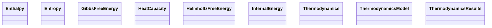

# Thermodynamics

**Purpose.** Thermodynamic state functions and models.
**In scope:** state functions, derived thermodynamic curves
**Out of scope:** MD raw trajectories (see Results)

## Relationship map





## Key sections

| Section | MetaInfo |
|---|---|
| `Thermodynamics` | [Open in MetaInfo browser](https://nomad-lab.eu/prod/v1/gui/analyze/metainfo) |
| `ThermodynamicsModel` | [Open in MetaInfo browser](https://nomad-lab.eu/prod/v1/gui/analyze/metainfo) |
| `ThermodynamicsResults` | [Open in MetaInfo browser](https://nomad-lab.eu/prod/v1/gui/analyze/metainfo) |
| `HeatCapacity` | [Open in MetaInfo browser](https://nomad-lab.eu/prod/v1/gui/analyze/metainfo) |
| `Entropy` | [Open in MetaInfo browser](https://nomad-lab.eu/prod/v1/gui/analyze/metainfo) |
| `HelmholtzFreeEnergy` | [Open in MetaInfo browser](https://nomad-lab.eu/prod/v1/gui/analyze/metainfo) |
| `GibbsFreeEnergy` | [Open in MetaInfo browser](https://nomad-lab.eu/prod/v1/gui/analyze/metainfo) |
| `Enthalpy` | [Open in MetaInfo browser](https://nomad-lab.eu/prod/v1/gui/analyze/metainfo) |
| `InternalEnergy` | [Open in MetaInfo browser](https://nomad-lab.eu/prod/v1/gui/analyze/metainfo) |


## Micro-examples

=== "YAML"

    ```yaml
    Thermodynamics: {}
    ThermodynamicsModel: {}
    ThermodynamicsResults:
      n_values:
      - null
      temperature:
      - null
      pressure:
      - null
    HeatCapacity:
      value:
      - null
    Entropy:
      value:
      - null
    HelmholtzFreeEnergy: {}
    GibbsFreeEnergy: {}
    Enthalpy: {}
    InternalEnergy: {}
    ```