# Thermodynamic Properties

**Purpose:** Energies, forces, pressure, temperature, and thermodynamic state functions

**In scope:**

- Energy hierarchy: BaseEnergy → specific energy types
- Free energies: Gibbs, Helmholtz
- Force hierarchy: BaseForce → TotalForce
- Thermodynamic state variables: pressure, volume, temperature
- Entropy and heat capacities
- Virial tensor for stress calculations
- Hessian matrices for phonon calculations

## Relationship map

```mermaid
classDiagram
    class BaseEnergy
    class BaseForce
    class ChemicalPotential
    class Enthalpy
    class Entropy
    class GibbsFreeEnergy
    class Heat
    class HeatCapacity
    class HelmholtzFreeEnergy
    class Hessian
    class InternalEnergy
    class KineticEnergy
    class MassDensity
    class PotentialEnergy
    class Pressure
    class Temperature
    class TotalEnergy
    class TotalForce
    class VirialTensor
    class Volume
    class Work
    BaseEnergy <|-- ChemicalPotential
    BaseEnergy <|-- Enthalpy
    BaseEnergy <|-- GibbsFreeEnergy
    BaseEnergy <|-- Heat
    BaseEnergy <|-- HelmholtzFreeEnergy
    BaseEnergy <|-- InternalEnergy
    BaseEnergy <|-- KineticEnergy
    BaseEnergy <|-- PotentialEnergy
    BaseEnergy <|-- TotalEnergy
    BaseForce <|-- TotalForce
    BaseEnergy <|-- VirialTensor
    BaseEnergy <|-- Work
    TotalEnergy *-- BaseEnergy : contributions
    TotalForce *-- BaseForce : contributions
```

Legend

<svg class="uml-legend__swatch" viewBox="0 0 64 16" aria-hidden="true"><line class="uml-legend__line" x1="54" y1="8" x2="22" y2="8"/><path class="uml-legend__head uml-legend__head--open" d="M10 8 L22 2 L22 14 Z"/></svg>inheritance (is-a)

<svg class="uml-legend__swatch" viewBox="0 0 64 16" aria-hidden="true"><path class="uml-legend__head uml-legend__head--filled" d="M10 8 L16 2 L22 8 L16 14 Z"/><line class="uml-legend__line" x1="22" y1="8" x2="52" y2="8"/></svg>composition (has-a)

## Quantities by Key Sections

### `BaseEnergy`

| Section | Description | MetaInfo |
|---|---|---|
| `BaseEnergy` | Abstract class used to define a common `value` quantity with the appropriate units for different types of energies, which avoids repeating the definit... | [Open in MetaInfo browser](https://nomad-lab.eu/prod/v1/develop/gui/analyze/metainfo/nomad_simulations/section_definitions@nomad_simulations.schema_packages.properties.energies.BaseEnergy){:target="_blank"} |

| Quantity | Type | Description |
|---|---|---|
| `value` | m_float64(float64) | No description available. |

### `TotalEnergy`

| Section | Description | MetaInfo |
|---|---|---|
| `TotalEnergy` | The total energy of a system. | [Open in MetaInfo browser](https://nomad-lab.eu/prod/v1/develop/gui/analyze/metainfo/nomad_simulations/section_definitions@nomad_simulations.schema_packages.properties.energies.TotalEnergy){:target="_blank"} |

*This section has no direct quantities.*

### `KineticEnergy`

| Section | Description | MetaInfo |
|---|---|---|
| `KineticEnergy` | Physical property section describing the kinetic energy of a (sub)system. | [Open in MetaInfo browser](https://nomad-lab.eu/prod/v1/develop/gui/analyze/metainfo/nomad_simulations/section_definitions@nomad_simulations.schema_packages.properties.energies.KineticEnergy){:target="_blank"} |

*This section has no direct quantities.*

### `PotentialEnergy`

| Section | Description | MetaInfo |
|---|---|---|
| `PotentialEnergy` | Physical property section describing the potential energy of a (sub)system. | [Open in MetaInfo browser](https://nomad-lab.eu/prod/v1/develop/gui/analyze/metainfo/nomad_simulations/section_definitions@nomad_simulations.schema_packages.properties.energies.PotentialEnergy){:target="_blank"} |

*This section has no direct quantities.*

### `Heat`

| Section | Description | MetaInfo |
|---|---|---|
| `Heat` | The transfer of thermal energy **into** a system. | [Open in MetaInfo browser](https://nomad-lab.eu/prod/v1/develop/gui/analyze/metainfo/nomad_simulations/section_definitions@nomad_simulations.schema_packages.properties.thermodynamics.Heat){:target="_blank"} |

*This section has no direct quantities.*

### `Work`

| Section | Description | MetaInfo |
|---|---|---|
| `Work` | The energy transferred to a system by means of force applied over a distance. | [Open in MetaInfo browser](https://nomad-lab.eu/prod/v1/develop/gui/analyze/metainfo/nomad_simulations/section_definitions@nomad_simulations.schema_packages.properties.thermodynamics.Work){:target="_blank"} |

*This section has no direct quantities.*

### `InternalEnergy`

| Section | Description | MetaInfo |
|---|---|---|
| `InternalEnergy` | The total energy contained within a system, encompassing both kinetic and potential energies of the particles. | [Open in MetaInfo browser](https://nomad-lab.eu/prod/v1/develop/gui/analyze/metainfo/nomad_simulations/section_definitions@nomad_simulations.schema_packages.properties.thermodynamics.InternalEnergy){:target="_blank"} |

*This section has no direct quantities.*

### `Enthalpy`

| Section | Description | MetaInfo |
|---|---|---|
| `Enthalpy` | The total heat content of a system, defined as 'InternalEnergy' + 'Pressure' * 'Volume'. | [Open in MetaInfo browser](https://nomad-lab.eu/prod/v1/develop/gui/analyze/metainfo/nomad_simulations/section_definitions@nomad_simulations.schema_packages.properties.thermodynamics.Enthalpy){:target="_blank"} |

*This section has no direct quantities.*

### `GibbsFreeEnergy`

| Section | Description | MetaInfo |
|---|---|---|
| `GibbsFreeEnergy` | The energy available to do work in a system at constant temperature and pressure, given by `Enthalpy` - `Temperature` * `Entropy`. | [Open in MetaInfo browser](https://nomad-lab.eu/prod/v1/develop/gui/analyze/metainfo/nomad_simulations/section_definitions@nomad_simulations.schema_packages.properties.thermodynamics.GibbsFreeEnergy){:target="_blank"} |

*This section has no direct quantities.*

### `HelmholtzFreeEnergy`

| Section | Description | MetaInfo |
|---|---|---|
| `HelmholtzFreeEnergy` | The energy available to do work in a system at constant volume and temperature, given by `InternalEnergy` - `Temperature` * `Entropy`. | [Open in MetaInfo browser](https://nomad-lab.eu/prod/v1/develop/gui/analyze/metainfo/nomad_simulations/section_definitions@nomad_simulations.schema_packages.properties.thermodynamics.HelmholtzFreeEnergy){:target="_blank"} |

*This section has no direct quantities.*

### `ChemicalPotential`

| Section | Description | MetaInfo |
|---|---|---|
| `ChemicalPotential` | Free energy cost of adding or extracting a particle from a thermodynamic system. | [Open in MetaInfo browser](https://nomad-lab.eu/prod/v1/develop/gui/analyze/metainfo/nomad_simulations/section_definitions@nomad_simulations.schema_packages.properties.thermodynamics.ChemicalPotential){:target="_blank"} |

| Quantity | Type | Description |
|---|---|---|
| `temperature` | m_float64(float64) | Temperature at which the chemical potential is calculated. Essential for finite-temperature calculations. |
| `particle_number` | m_float64(float64) | Number of particles (or particle density) for which the chemical potential applies. Can represent electron number, atom number, or other relevant particle count. |
| `fermi_energy` | m_float64(float64) | Fermi energy at T=0K, used as reference for finite-temperature chemical potential. At T=0, the chemical potential equals the Fermi energy. |
| `type` | m_str(str) | Type of chemical potential calculation. Examples: 'electronic', 'atomic', 'ionic', 'molecular'. Helps identify what kind of particles this applies to. |

### `VirialTensor`

| Section | Description | MetaInfo |
|---|---|---|
| `VirialTensor` | A measure of the distribution of internal forces and the overall stress within a system of particles. | [Open in MetaInfo browser](https://nomad-lab.eu/prod/v1/develop/gui/analyze/metainfo/nomad_simulations/section_definitions@nomad_simulations.schema_packages.properties.thermodynamics.VirialTensor){:target="_blank"} |

*This section has no direct quantities.*

### `BaseForce`

| Section | Description | MetaInfo |
|---|---|---|
| `BaseForce` | Base class used to define a common `value` quantity with the appropriate units for different types of forces, which avoids repeating the definitions f... | [Open in MetaInfo browser](https://nomad-lab.eu/prod/v1/develop/gui/analyze/metainfo/nomad_simulations/section_definitions@nomad_simulations.schema_packages.properties.forces.BaseForce){:target="_blank"} |

| Quantity | Type | Description |
|---|---|---|
| `value` | m_float64(float64) (shape: ['*', '*']) | No description available. |

### `TotalForce`

| Section | Description | MetaInfo |
|---|---|---|
| `TotalForce` | The total force of a system. | [Open in MetaInfo browser](https://nomad-lab.eu/prod/v1/develop/gui/analyze/metainfo/nomad_simulations/section_definitions@nomad_simulations.schema_packages.properties.forces.TotalForce){:target="_blank"} |

*This section has no direct quantities.*

### `Pressure`

| Section | Description | MetaInfo |
|---|---|---|
| `Pressure` | The force exerted per unit area by gas particles as they collide with the walls of their container. | [Open in MetaInfo browser](https://nomad-lab.eu/prod/v1/develop/gui/analyze/metainfo/nomad_simulations/section_definitions@nomad_simulations.schema_packages.properties.thermodynamics.Pressure){:target="_blank"} |

| Quantity | Type | Description |
|---|---|---|
| `value` | m_float64(float64) | No description available. |

### `Volume`

| Section | Description | MetaInfo |
|---|---|---|
| `Volume` | the amount of three-dimensional space that a substance or material occupies. | [Open in MetaInfo browser](https://nomad-lab.eu/prod/v1/develop/gui/analyze/metainfo/nomad_simulations/section_definitions@nomad_simulations.schema_packages.properties.thermodynamics.Volume){:target="_blank"} |

| Quantity | Type | Description |
|---|---|---|
| `value` | m_float64(float64) | No description available. |

### `Temperature`

| Section | Description | MetaInfo |
|---|---|---|
| `Temperature` |  | [Open in MetaInfo browser](https://nomad-lab.eu/prod/v1/develop/gui/analyze/metainfo/nomad_simulations/section_definitions@nomad_simulations.schema_packages.variables.Temperature){:target="_blank"} |

| Quantity | Type | Description |
|---|---|---|
| `points` | m_float64(float64) (shape: ['n_points']) | Points in which the temperature is discretized. |

### `Entropy`

| Section | Description | MetaInfo |
|---|---|---|
| `Entropy` | A measure of the disorder or randomness in a system. | [Open in MetaInfo browser](https://nomad-lab.eu/prod/v1/develop/gui/analyze/metainfo/nomad_simulations/section_definitions@nomad_simulations.schema_packages.properties.thermodynamics.Entropy){:target="_blank"} |

| Quantity | Type | Description |
|---|---|---|
| `value` | m_float64(float64) | No description available. |

### `HeatCapacity`

| Section | Description | MetaInfo |
|---|---|---|
| `HeatCapacity` | Amount of heat to be supplied to a material to produce a unit change in its temperature. | [Open in MetaInfo browser](https://nomad-lab.eu/prod/v1/develop/gui/analyze/metainfo/nomad_simulations/section_definitions@nomad_simulations.schema_packages.properties.thermodynamics.HeatCapacity){:target="_blank"} |

| Quantity | Type | Description |
|---|---|---|
| `value` | m_float64(float64) | No description available. |

### `MassDensity`

| Section | Description | MetaInfo |
|---|---|---|
| `MassDensity` | Mass per unit volume of a material. | [Open in MetaInfo browser](https://nomad-lab.eu/prod/v1/develop/gui/analyze/metainfo/nomad_simulations/section_definitions@nomad_simulations.schema_packages.properties.thermodynamics.MassDensity){:target="_blank"} |

| Quantity | Type | Description |
|---|---|---|
| `value` | m_float64(float64) | No description available. |

### `Hessian`

| Section | Description | MetaInfo |
|---|---|---|
| `Hessian` | A square matrix of second-order partial derivatives of a potential energy function, describing the local curvature of the energy surface. | [Open in MetaInfo browser](https://nomad-lab.eu/prod/v1/develop/gui/analyze/metainfo/nomad_simulations/section_definitions@nomad_simulations.schema_packages.properties.thermodynamics.Hessian){:target="_blank"} |

| Quantity | Type | Description |
|---|---|---|
| `n_hessian_dim` | m_int_bounded(int) | 

Matrix dimension (number of degrees of freedom) of the square Hessian in the
Matrix dimension (number of degrees of freedom) of the square Hessian in the coordinate basis used by the parser. For Cartesian atomic Hessians this is typically 3 * N_atoms; constrained/filtered coordinates should use the remaining degrees of freedom.
 |
| `value` | m_float64(float64) (shape: ['n_hessian_dim', 'n_hessian_dim']) | No description available. |
| `n_negative_eigenvalues` | m_int_bounded(int) | 

Number of negative Hessian eigenvalues (imaginary vibrational frequencies).
Number of negative Hessian eigenvalues (imaginary vibrational frequencies). A value of 0 indicates a local minimum, 1 a first-order saddle point, and >1 a higher-order saddle point. Leave unset if the Hessian was evaluated away from a stationary point.
 |
| `eigenvalues` | m_float64(float64) (shape: ['*']) | 

Eigenvalues of the Hessian.
Eigenvalues of the Hessian. Sorted during normalization with positive values descending, followed by zeros, then negative values ascending (most negative first). Very low-magnitude modes in solid-state phonon calculations (e.g., <100 cm-1) or when using RI/DF approximations often reflect numerical artifacts rather than true instabilities.
 |
| `stationary_point_type` | Enum | 

Stationary-point classification (requires zero gradient) based on Hessian
Stationary-point classification (requires zero gradient) based on Hessian eigenvalue signs. Use 'saddle_point' for any stationary point with one or more negative eigenvalues (a transition state corresponds to exactly one). Use 'maximum' when all eigenvalues are negative (negative-definite Hessian). Use 'non_stationary' if the Hessian was evaluated where the gradient is non-zero and no stationary point classification applies. Use 'unavailable' when no classification could be determined from the data.
 |

