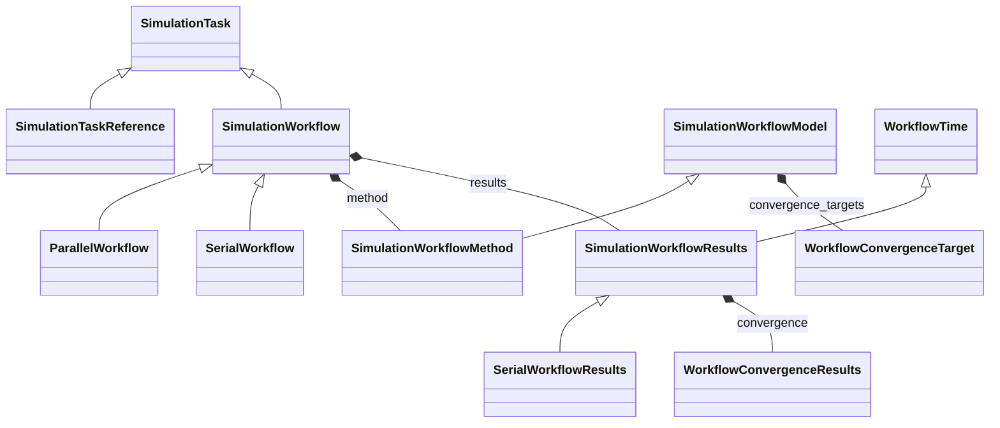

# Workflow Core

**Purpose:** Core workflow hierarchy and shared method/results structures

**In scope:**

- Workflow task abstraction and task-reference linkage
- Core inheritance spine: SimulationWorkflow with serial/parallel specializations
- Shared workflow model and method metadata containers
- Shared workflow result timing and convergence result containers

## Relationship map

Legend

<svg class="uml-legend__swatch" viewBox="0 0 64 16" aria-hidden="true"><line class="uml-legend__line" x1="54" y1="8" x2="22" y2="8"/><path class="uml-legend__head uml-legend__head--open" d="M10 8 L22 2 L22 14 Z"/></svg>inheritance (is-a)

<svg class="uml-legend__swatch" viewBox="0 0 64 16" aria-hidden="true"><path class="uml-legend__head uml-legend__head--filled" d="M10 8 L16 2 L22 8 L16 14 Z"/><line class="uml-legend__line" x1="22" y1="8" x2="52" y2="8"/></svg>composition (has-a)

## Quantities by Key Sections

### `SimulationTask`

| Section | Description | MetaInfo |
|---|---|---|
| `SimulationTask` |  | [Open in MetaInfo browser](https://nomad-lab.eu/prod/v1/develop/gui/analyze/metainfo/nomad_simulations/section_definitions@nomad_simulations.schema_packages.workflow.general.SimulationTask){:target="_blank"} |

*This section has no direct quantities.*

### `SimulationTaskReference`

| Section | Description | MetaInfo |
|---|---|---|
| `SimulationTaskReference` |  | [Open in MetaInfo browser](https://nomad-lab.eu/prod/v1/develop/gui/analyze/metainfo/nomad_simulations/section_definitions@nomad_simulations.schema_packages.workflow.general.SimulationTaskReference){:target="_blank"} |

*This section has no direct quantities.*

### `SimulationWorkflow`

| Section | Description | MetaInfo |
|---|---|---|
| `SimulationWorkflow` | Base class for simulation workflows. | [Open in MetaInfo browser](https://nomad-lab.eu/prod/v1/develop/gui/analyze/metainfo/nomad_simulations/section_definitions@nomad_simulations.schema_packages.workflow.general.SimulationWorkflow){:target="_blank"} |

*This section has no direct quantities.*

### `SerialWorkflow`

| Section | Description | MetaInfo |
|---|---|---|
| `SerialWorkflow` | Base class for workflows where tasks are executed sequentially. | [Open in MetaInfo browser](https://nomad-lab.eu/prod/v1/develop/gui/analyze/metainfo/nomad_simulations/section_definitions@nomad_simulations.schema_packages.workflow.general.SerialWorkflow){:target="_blank"} |

*This section has no direct quantities.*

### `ParallelWorkflow`

| Section | Description | MetaInfo |
|---|---|---|
| `ParallelWorkflow` | Base class for workflows where tasks are executed concurrently. | [Open in MetaInfo browser](https://nomad-lab.eu/prod/v1/develop/gui/analyze/metainfo/nomad_simulations/section_definitions@nomad_simulations.schema_packages.workflow.general.ParallelWorkflow){:target="_blank"} |

*This section has no direct quantities.*

### `SimulationWorkflowModel`

| Section | Description | MetaInfo |
|---|---|---|
| `SimulationWorkflowModel` | Base class for simulation workflow model sub-section definition. | [Open in MetaInfo browser](https://nomad-lab.eu/prod/v1/develop/gui/analyze/metainfo/nomad_simulations/section_definitions@nomad_simulations.schema_packages.workflow.general.SimulationWorkflowModel){:target="_blank"} |

| Quantity | Type | Description |
|---|---|---|
| `initial_system` | Reference | Reference to the input model_system. |
| `initial_method` | Reference | Reference to the input model_method. |

### `SimulationWorkflowMethod`

| Section | Description | MetaInfo |
|---|---|---|
| `SimulationWorkflowMethod` |  | [Open in MetaInfo browser](https://nomad-lab.eu/prod/v1/develop/gui/analyze/metainfo/nomad_simulations/section_definitions@nomad_simulations.schema_packages.workflow.general.SimulationWorkflowMethod){:target="_blank"} |

*This section has no direct quantities.*

### `WorkflowTime`

| Section | Description | MetaInfo |
|---|---|---|
| `WorkflowTime` | Contains time-related quantities. | [Open in MetaInfo browser](https://nomad-lab.eu/prod/v1/develop/gui/analyze/metainfo/nomad_simulations/section_definitions@nomad_simulations.schema_packages.workflow.general.WorkflowTime){:target="_blank"} |

| Quantity | Type | Description |
|---|---|---|
| `datetime_end` | Datetime | The date and time when the workflow ended. |
| `cpu1_start` | m_float64(float64) | The starting time of the workflow on the (first) CPU 1. |
| `cpu1_end` | m_float64(float64) | The end time of the workflow on the (first) CPU 1. |
| `wall_start` | m_float64(float64) | The internal wall-clock time from the starting of the workflow. |
| `wall_end` | m_float64(float64) | The internal wall-clock time from the end of the workflow. |

### `SimulationWorkflowResults`

| Section | Description | MetaInfo |
|---|---|---|
| `SimulationWorkflowResults` | Base class for simulation workflow results sub-section definition. | [Open in MetaInfo browser](https://nomad-lab.eu/prod/v1/develop/gui/analyze/metainfo/nomad_simulations/section_definitions@nomad_simulations.schema_packages.workflow.general.SimulationWorkflowResults){:target="_blank"} |

| Quantity | Type | Description |
|---|---|---|
| `finished_normally` | m_bool(bool) | Indicates if calculation terminated normally. |
| `is_converged` | m_bool(bool) | Represents if the convergence targets have been reached (True) or not (False). |

### `SerialWorkflowResults`

| Section | Description | MetaInfo |
|---|---|---|
| `SerialWorkflowResults` |  | [Open in MetaInfo browser](https://nomad-lab.eu/prod/v1/develop/gui/analyze/metainfo/nomad_simulations/section_definitions@nomad_simulations.schema_packages.workflow.general.SerialWorkflowResults){:target="_blank"} |

*This section has no direct quantities.*

### `WorkflowConvergenceTarget`

| Section | Description | MetaInfo |
|---|---|---|
| `WorkflowConvergenceTarget` | Base section for defining convergence targets. | [Open in MetaInfo browser](https://nomad-lab.eu/prod/v1/develop/gui/analyze/metainfo/nomad_simulations/section_definitions@nomad_simulations.schema_packages.workflow.general.WorkflowConvergenceTarget){:target="_blank"} |

| Quantity | Type | Description |
|---|---|---|
| `threshold` | m_float_bounded(float) | 

Convergence threshold.
Convergence threshold. Must be non-negative. When threshold_type is 'relative', must be dimensionless. When threshold_type is 'absolute', 'maximum', or 'rms', must have physical units. Child classes override this to add convergence path annotations.
 |
| `threshold_type` | Enum | 

Specifies the mathematical method used to evaluate convergence between successive iterations.
Specifies the mathematical method used to evaluate convergence between successive iterations. Supported methods include: \| Name \| Description \| \| --------- \| -------------------------------- \| \| `'absolute'` \| Difference in absolute terms between two subsequent iterations (e.g., \\|E(n) - E(n-1)\\|). Most common for energy convergence. \| \| `'relative'` \| Difference as a fraction of the total property value (e.g., \\|E(n) - E(n-1)\\|/\\|E(n)\\|). Useful when the magnitude of the property varies widely across systems. \| \| `'maximum'` \| Maximum absolute difference across the whole quantity data (e.g., max(\\|\\|F_i(n) - F_i(n-1)\\|\\|) for forces). Suitable for vector quantities like forces or stress tensor elements. \| \| `'rms'` \| Root mean square of the dataset as a whole (e.g., sqrt(sum(\\|\\|F_i(n) - F_i(n-1)\\|\\|²)/N)). Provides a statistical measure of overall convergence for multi-component properties. \| Note: 'relative' requires dimensionless threshold; other types require physical units matching the property. The mode used affects both convergence behavior and computational efficiency. Different codes may default to different comparison modes for the same physical property.
 |

### `WorkflowConvergenceResults`

| Section | Description | MetaInfo |
|---|---|---|
| `WorkflowConvergenceResults` | Results of workflow convergence checks. | [Open in MetaInfo browser](https://nomad-lab.eu/prod/v1/develop/gui/analyze/metainfo/nomad_simulations/section_definitions@nomad_simulations.schema_packages.workflow.general.WorkflowConvergenceResults){:target="_blank"} |

| Quantity | Type | Description |
|---|---|---|
| `convergence_target_ref` | Reference | Reference to the workflow convergence target that this result corresponds to. |
| `is_reached` | m_bool(bool) | Indicates whether this convergence target was reached (True) or not (False). |

## Related Pages

- [Convergence Targets: Schema Traversal Guide](../explanation/workflow/convergence.md)
- [Workflow Overview](../explanation/workflow/overview.md)
