# Beyond-DFT Workflow Family

**Purpose:** Beyond-DFT workflow base classes and derived GW/TB/DMFT/XS specializations

## Relationship map

```mermaid
classDiagram
    class BeyondDFTMethod
    class BeyondDFTResults
    class BeyondDFTWorkflow
    class DFTGWMethod
    class DFTGWResults
    class DFTGWWorkflow
    class DFTLocalCCMethod
    class DFTLocalCCResults
    class DFTLocalCCWorkflow
    class DFTTBDMFTMethod
    class DFTTBDMFTResults
    class DFTTBDMFTWorkflow
    class DFTTBMethod
    class DFTTBResults
    class DFTTBWorkflow
    class DMFTMaxEntWorkflow
    class DMTMaxEntMethod
    class DMTMaxEntResults
    class ElectronicStructureResults
    class SerialWorkflow
    class SimulationWorkflowMethod
    class SimulationWorkflowResults
    class WorkflowConvergenceResults
    class XSMethod
    class XSResults
    class XSWorkflow
    SimulationWorkflowMethod <|-- BeyondDFTMethod
    SimulationWorkflowResults <|-- BeyondDFTResults
    SerialWorkflow <|-- BeyondDFTWorkflow
    BeyondDFTMethod <|-- DFTGWMethod
    BeyondDFTResults <|-- DFTGWResults
    BeyondDFTWorkflow <|-- DFTGWWorkflow
    BeyondDFTMethod <|-- DFTLocalCCMethod
    BeyondDFTResults <|-- DFTLocalCCResults
    BeyondDFTWorkflow <|-- DFTLocalCCWorkflow
    BeyondDFTMethod <|-- DFTTBDMFTMethod
    BeyondDFTResults <|-- DFTTBDMFTResults
    BeyondDFTWorkflow <|-- DFTTBDMFTWorkflow
    BeyondDFTMethod <|-- DFTTBMethod
    BeyondDFTResults <|-- DFTTBResults
    BeyondDFTWorkflow <|-- DFTTBWorkflow
    BeyondDFTWorkflow <|-- DMFTMaxEntWorkflow
    BeyondDFTMethod <|-- DMTMaxEntMethod
    BeyondDFTResults <|-- DMTMaxEntResults
    SimulationWorkflowResults <|-- ElectronicStructureResults
    BeyondDFTMethod <|-- XSMethod
    BeyondDFTResults <|-- XSResults
    BeyondDFTWorkflow <|-- XSWorkflow
    BeyondDFTResults *-- ElectronicStructureResults : dft
    BeyondDFTResults *-- ElectronicStructureResults : ext
    BeyondDFTWorkflow *-- BeyondDFTMethod : method
    BeyondDFTWorkflow *-- BeyondDFTResults : results
    DFTGWWorkflow *-- DFTGWMethod : method
    DFTGWWorkflow *-- DFTGWResults : results
    DFTTBDMFTWorkflow *-- DFTTBDMFTMethod : method
    DFTTBDMFTWorkflow *-- DFTTBDMFTResults : results
    DFTTBWorkflow *-- DFTTBMethod : method
    DFTTBWorkflow *-- DFTTBResults : results
    DMFTMaxEntWorkflow *-- DMTMaxEntMethod : method
    DMFTMaxEntWorkflow *-- DMTMaxEntResults : results
    SimulationWorkflowResults *-- WorkflowConvergenceResults : convergence
    XSWorkflow *-- XSMethod : method
    XSWorkflow *-- XSResults : results
```

Legend

<svg class="uml-legend__swatch" viewBox="0 0 64 16" aria-hidden="true"><line class="uml-legend__line" x1="54" y1="8" x2="22" y2="8"/><path class="uml-legend__head uml-legend__head--open" d="M10 8 L22 2 L22 14 Z"/></svg>inheritance (is-a)

<svg class="uml-legend__swatch" viewBox="0 0 64 16" aria-hidden="true"><path class="uml-legend__head uml-legend__head--filled" d="M10 8 L16 2 L22 8 L16 14 Z"/><line class="uml-legend__line" x1="22" y1="8" x2="52" y2="8"/></svg>composition (has-a)

## Quantities by Key Sections

### `SerialWorkflow`

| Section | Description | MetaInfo |
|---|---|---|
| `SerialWorkflow` | Base class for workflows where tasks are executed sequentially. | [Open in MetaInfo browser](https://nomad-lab.eu/prod/v1/develop/gui/analyze/metainfo/nomad_simulations/section_definitions@nomad_simulations.schema_packages.workflow.general.SerialWorkflow){:target="_blank"} |

*This section has no direct quantities.*

### `SimulationWorkflowMethod`

| Section | Description | MetaInfo |
|---|---|---|
| `SimulationWorkflowMethod` |  | [Open in MetaInfo browser](https://nomad-lab.eu/prod/v1/develop/gui/analyze/metainfo/nomad_simulations/section_definitions@nomad_simulations.schema_packages.workflow.general.SimulationWorkflowMethod){:target="_blank"} |

*This section has no direct quantities.*

### `SimulationWorkflowResults`

| Section | Description | MetaInfo |
|---|---|---|
| `SimulationWorkflowResults` | Base class for simulation workflow results sub-section definition. | [Open in MetaInfo browser](https://nomad-lab.eu/prod/v1/develop/gui/analyze/metainfo/nomad_simulations/section_definitions@nomad_simulations.schema_packages.workflow.general.SimulationWorkflowResults){:target="_blank"} |

| Quantity | Type | Description |
|---|---|---|
| `finished_normally` | m_bool(bool) | Indicates if calculation terminated normally. |
| `is_converged` | m_bool(bool) | Represents if the convergence targets have been reached (True) or not (False). |

### `ElectronicStructureResults`

| Section | Description | MetaInfo |
|---|---|---|
| `ElectronicStructureResults` | Contains definitions for results of an electronic structure simulation. | [Open in MetaInfo browser](https://nomad-lab.eu/prod/v1/develop/gui/analyze/metainfo/nomad_simulations/section_definitions@nomad_simulations.schema_packages.workflow.general.ElectronicStructureResults){:target="_blank"} |

| Quantity | Type | Description |
|---|---|---|
| `dos` | Reference | Reference to the electronic density of states output. |

### `BeyondDFTWorkflow`

| Section | Description | MetaInfo |
|---|---|---|
| `BeyondDFTWorkflow` | Definitions for workflows based on DFT. | [Open in MetaInfo browser](https://nomad-lab.eu/prod/v1/develop/gui/analyze/metainfo/nomad_simulations/section_definitions@nomad_simulations.schema_packages.workflow.beyond_dft.BeyondDFTWorkflow){:target="_blank"} |

*This section has no direct quantities.*

### `BeyondDFTMethod`

| Section | Description | MetaInfo |
|---|---|---|
| `BeyondDFTMethod` |  | [Open in MetaInfo browser](https://nomad-lab.eu/prod/v1/develop/gui/analyze/metainfo/nomad_simulations/section_definitions@nomad_simulations.schema_packages.workflow.beyond_dft.BeyondDFTMethod){:target="_blank"} |

*This section has no direct quantities.*

### `BeyondDFTResults`

| Section | Description | MetaInfo |
|---|---|---|
| `BeyondDFTResults` | Contains reference to DFT outputs. | [Open in MetaInfo browser](https://nomad-lab.eu/prod/v1/develop/gui/analyze/metainfo/nomad_simulations/section_definitions@nomad_simulations.schema_packages.workflow.beyond_dft.BeyondDFTResults){:target="_blank"} |

*This section has no direct quantities.*

### `DFTLocalCCWorkflow`

| Section | Description | MetaInfo |
|---|---|---|
| `DFTLocalCCWorkflow` | Definitions for local coupled-cluster calculations based on DFT (DFT -> orbital localization -> local CC). | [Open in MetaInfo browser](https://nomad-lab.eu/prod/v1/develop/gui/analyze/metainfo/nomad_simulations/section_definitions@nomad_simulations.schema_packages.workflow.coupled_cluster.DFTLocalCCWorkflow){:target="_blank"} |

*This section has no direct quantities.*

### `DFTLocalCCMethod`

| Section | Description | MetaInfo |
|---|---|---|
| `DFTLocalCCMethod` |  | [Open in MetaInfo browser](https://nomad-lab.eu/prod/v1/develop/gui/analyze/metainfo/nomad_simulations/section_definitions@nomad_simulations.schema_packages.workflow.coupled_cluster.DFTLocalCCMethod){:target="_blank"} |

*This section has no direct quantities.*

### `DFTLocalCCResults`

| Section | Description | MetaInfo |
|---|---|---|
| `DFTLocalCCResults` |  | [Open in MetaInfo browser](https://nomad-lab.eu/prod/v1/develop/gui/analyze/metainfo/nomad_simulations/section_definitions@nomad_simulations.schema_packages.workflow.coupled_cluster.DFTLocalCCResults){:target="_blank"} |

*This section has no direct quantities.*

### `DFTGWWorkflow`

| Section | Description | MetaInfo |
|---|---|---|
| `DFTGWWorkflow` | Definitions for GW calculations based on DFT. | [Open in MetaInfo browser](https://nomad-lab.eu/prod/v1/develop/gui/analyze/metainfo/nomad_simulations/section_definitions@nomad_simulations.schema_packages.workflow.gw.DFTGWWorkflow){:target="_blank"} |

*This section has no direct quantities.*

### `DFTGWMethod`

| Section | Description | MetaInfo |
|---|---|---|
| `DFTGWMethod` |  | [Open in MetaInfo browser](https://nomad-lab.eu/prod/v1/develop/gui/analyze/metainfo/nomad_simulations/section_definitions@nomad_simulations.schema_packages.workflow.gw.DFTGWMethod){:target="_blank"} |

*This section has no direct quantities.*

### `DFTGWResults`

| Section | Description | MetaInfo |
|---|---|---|
| `DFTGWResults` |  | [Open in MetaInfo browser](https://nomad-lab.eu/prod/v1/develop/gui/analyze/metainfo/nomad_simulations/section_definitions@nomad_simulations.schema_packages.workflow.gw.DFTGWResults){:target="_blank"} |

*This section has no direct quantities.*

### `DFTTBWorkflow`

| Section | Description | MetaInfo |
|---|---|---|
| `DFTTBWorkflow` | Definitions for TB calculations based on DFT. | [Open in MetaInfo browser](https://nomad-lab.eu/prod/v1/develop/gui/analyze/metainfo/nomad_simulations/section_definitions@nomad_simulations.schema_packages.workflow.tb.DFTTBWorkflow){:target="_blank"} |

*This section has no direct quantities.*

### `DFTTBMethod`

| Section | Description | MetaInfo |
|---|---|---|
| `DFTTBMethod` |  | [Open in MetaInfo browser](https://nomad-lab.eu/prod/v1/develop/gui/analyze/metainfo/nomad_simulations/section_definitions@nomad_simulations.schema_packages.workflow.tb.DFTTBMethod){:target="_blank"} |

*This section has no direct quantities.*

### `DFTTBResults`

| Section | Description | MetaInfo |
|---|---|---|
| `DFTTBResults` |  | [Open in MetaInfo browser](https://nomad-lab.eu/prod/v1/develop/gui/analyze/metainfo/nomad_simulations/section_definitions@nomad_simulations.schema_packages.workflow.tb.DFTTBResults){:target="_blank"} |

*This section has no direct quantities.*

### `DFTTBDMFTWorkflow`

| Section | Description | MetaInfo |
|---|---|---|
| `DFTTBDMFTWorkflow` | Definitions for DMFT worklow based on DFT and TB. | [Open in MetaInfo browser](https://nomad-lab.eu/prod/v1/develop/gui/analyze/metainfo/nomad_simulations/section_definitions@nomad_simulations.schema_packages.workflow.dmft.DFTTBDMFTWorkflow){:target="_blank"} |

*This section has no direct quantities.*

### `DFTTBDMFTMethod`

| Section | Description | MetaInfo |
|---|---|---|
| `DFTTBDMFTMethod` |  | [Open in MetaInfo browser](https://nomad-lab.eu/prod/v1/develop/gui/analyze/metainfo/nomad_simulations/section_definitions@nomad_simulations.schema_packages.workflow.dmft.DFTTBDMFTMethod){:target="_blank"} |

*This section has no direct quantities.*

### `DFTTBDMFTResults`

| Section | Description | MetaInfo |
|---|---|---|
| `DFTTBDMFTResults` |  | [Open in MetaInfo browser](https://nomad-lab.eu/prod/v1/develop/gui/analyze/metainfo/nomad_simulations/section_definitions@nomad_simulations.schema_packages.workflow.dmft.DFTTBDMFTResults){:target="_blank"} |

*This section has no direct quantities.*

### `DMFTMaxEntWorkflow`

| Section | Description | MetaInfo |
|---|---|---|
| `DMFTMaxEntWorkflow` | Definitions for MaxEnt (Maximum Entropy) worklow based on DMFT. | [Open in MetaInfo browser](https://nomad-lab.eu/prod/v1/develop/gui/analyze/metainfo/nomad_simulations/section_definitions@nomad_simulations.schema_packages.workflow.max_ent.DMFTMaxEntWorkflow){:target="_blank"} |

*This section has no direct quantities.*

### `DMTMaxEntMethod`

| Section | Description | MetaInfo |
|---|---|---|
| `DMTMaxEntMethod` |  | [Open in MetaInfo browser](https://nomad-lab.eu/prod/v1/develop/gui/analyze/metainfo/nomad_simulations/section_definitions@nomad_simulations.schema_packages.workflow.max_ent.DMTMaxEntMethod){:target="_blank"} |

*This section has no direct quantities.*

### `DMTMaxEntResults`

| Section | Description | MetaInfo |
|---|---|---|
| `DMTMaxEntResults` |  | [Open in MetaInfo browser](https://nomad-lab.eu/prod/v1/develop/gui/analyze/metainfo/nomad_simulations/section_definitions@nomad_simulations.schema_packages.workflow.max_ent.DMTMaxEntResults){:target="_blank"} |

*This section has no direct quantities.*

### `XSWorkflow`

| Section | Description | MetaInfo |
|---|---|---|
| `XSWorkflow` | Definitions for XS workflow based in DFT, GW and PhotonPolarizationWorkflow. | [Open in MetaInfo browser](https://nomad-lab.eu/prod/v1/develop/gui/analyze/metainfo/nomad_simulations/section_definitions@nomad_simulations.schema_packages.workflow.xs.XSWorkflow){:target="_blank"} |

*This section has no direct quantities.*

### `XSMethod`

| Section | Description | MetaInfo |
|---|---|---|
| `XSMethod` |  | [Open in MetaInfo browser](https://nomad-lab.eu/prod/v1/develop/gui/analyze/metainfo/nomad_simulations/section_definitions@nomad_simulations.schema_packages.workflow.xs.XSMethod){:target="_blank"} |

*This section has no direct quantities.*

### `XSResults`

| Section | Description | MetaInfo |
|---|---|---|
| `XSResults` |  | [Open in MetaInfo browser](https://nomad-lab.eu/prod/v1/develop/gui/analyze/metainfo/nomad_simulations/section_definitions@nomad_simulations.schema_packages.workflow.xs.XSResults){:target="_blank"} |

*This section has no direct quantities.*

## Related Pages

- [Workflow Overview](../explanation/workflow/overview.md)
