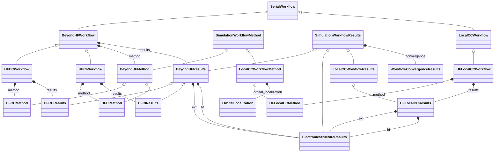

# Beyond-HF Workflow Family

**Purpose:** Beyond-HF workflow base classes with CC and CI derived branches

## Relationship map

Legend

<svg class="uml-legend__swatch" viewBox="0 0 64 16" aria-hidden="true"><line class="uml-legend__line" x1="54" y1="8" x2="22" y2="8"/><path class="uml-legend__head uml-legend__head--open" d="M10 8 L22 2 L22 14 Z"/></svg>inheritance (is-a)

<svg class="uml-legend__swatch" viewBox="0 0 64 16" aria-hidden="true"><path class="uml-legend__head uml-legend__head--filled" d="M10 8 L16 2 L22 8 L16 14 Z"/><line class="uml-legend__line" x1="22" y1="8" x2="52" y2="8"/></svg>composition (has-a)

## Quantities by Key Sections

### `SerialWorkflow`

| Section | Description | MetaInfo |
|---|---|---|
| `SerialWorkflow` | Base class for workflows where tasks are executed sequentially. | [Open in MetaInfo browser](https://nomad-lab.eu/prod/v1/develop/gui/analyze/metainfo/nomad_simulations/section_definitions@nomad_simulations.schema_packages.workflow.general.SerialWorkflow){:target="_blank"} |

*This section has no direct quantities.*

### `SimulationWorkflowMethod`

| Section | Description | MetaInfo |
|---|---|---|
| `SimulationWorkflowMethod` |  | [Open in MetaInfo browser](https://nomad-lab.eu/prod/v1/develop/gui/analyze/metainfo/nomad_simulations/section_definitions@nomad_simulations.schema_packages.workflow.general.SimulationWorkflowMethod){:target="_blank"} |

*This section has no direct quantities.*

### `SimulationWorkflowResults`

| Section | Description | MetaInfo |
|---|---|---|
| `SimulationWorkflowResults` | Base class for simulation workflow results sub-section definition. | [Open in MetaInfo browser](https://nomad-lab.eu/prod/v1/develop/gui/analyze/metainfo/nomad_simulations/section_definitions@nomad_simulations.schema_packages.workflow.general.SimulationWorkflowResults){:target="_blank"} |

| Quantity | Type | Description |
|---|---|---|
| `finished_normally` | m_bool(bool) | Indicates if calculation terminated normally. |
| `is_converged` | m_bool(bool) | Represents if the convergence targets have been reached (True) or not (False). |

### `ElectronicStructureResults`

| Section | Description | MetaInfo |
|---|---|---|
| `ElectronicStructureResults` | Contains definitions for results of an electronic structure simulation. | [Open in MetaInfo browser](https://nomad-lab.eu/prod/v1/develop/gui/analyze/metainfo/nomad_simulations/section_definitions@nomad_simulations.schema_packages.workflow.general.ElectronicStructureResults){:target="_blank"} |

| Quantity | Type | Description |
|---|---|---|
| `dos` | Reference | Reference to the electronic density of states output. |

### `BeyondHFWorkflow`

| Section | Description | MetaInfo |
|---|---|---|
| `BeyondHFWorkflow` | Base workflow for post-HF methods (e.g., HF → CC, HF → CI). | [Open in MetaInfo browser](https://nomad-lab.eu/prod/v1/develop/gui/analyze/metainfo/nomad_simulations/section_definitions@nomad_simulations.schema_packages.workflow.beyond_hf.BeyondHFWorkflow){:target="_blank"} |

*This section has no direct quantities.*

### `BeyondHFMethod`

| Section | Description | MetaInfo |
|---|---|---|
| `BeyondHFMethod` |  | [Open in MetaInfo browser](https://nomad-lab.eu/prod/v1/develop/gui/analyze/metainfo/nomad_simulations/section_definitions@nomad_simulations.schema_packages.workflow.beyond_hf.BeyondHFMethod){:target="_blank"} |

*This section has no direct quantities.*

### `BeyondHFResults`

| Section | Description | MetaInfo |
|---|---|---|
| `BeyondHFResults` | Contains references to HF outputs (baseline) and extended post-HF results. | [Open in MetaInfo browser](https://nomad-lab.eu/prod/v1/develop/gui/analyze/metainfo/nomad_simulations/section_definitions@nomad_simulations.schema_packages.workflow.beyond_hf.BeyondHFResults){:target="_blank"} |

*This section has no direct quantities.*

### `HFCCWorkflow`

| Section | Description | MetaInfo |
|---|---|---|
| `HFCCWorkflow` | Definitions for Coupled-Cluster calculations based on HF (HF → CC). | [Open in MetaInfo browser](https://nomad-lab.eu/prod/v1/develop/gui/analyze/metainfo/nomad_simulations/section_definitions@nomad_simulations.schema_packages.workflow.coupled_cluster.HFCCWorkflow){:target="_blank"} |

*This section has no direct quantities.*

### `HFCCMethod`

| Section | Description | MetaInfo |
|---|---|---|
| `HFCCMethod` |  | [Open in MetaInfo browser](https://nomad-lab.eu/prod/v1/develop/gui/analyze/metainfo/nomad_simulations/section_definitions@nomad_simulations.schema_packages.workflow.coupled_cluster.HFCCMethod){:target="_blank"} |

*This section has no direct quantities.*

### `HFCCResults`

| Section | Description | MetaInfo |
|---|---|---|
| `HFCCResults` |  | [Open in MetaInfo browser](https://nomad-lab.eu/prod/v1/develop/gui/analyze/metainfo/nomad_simulations/section_definitions@nomad_simulations.schema_packages.workflow.coupled_cluster.HFCCResults){:target="_blank"} |

*This section has no direct quantities.*

### `HFLocalCCWorkflow`

| Section | Description | MetaInfo |
|---|---|---|
| `HFLocalCCWorkflow` | Definitions for local coupled-cluster calculations based on HF (HF -> orbital localization -> local CC). | [Open in MetaInfo browser](https://nomad-lab.eu/prod/v1/develop/gui/analyze/metainfo/nomad_simulations/section_definitions@nomad_simulations.schema_packages.workflow.coupled_cluster.HFLocalCCWorkflow){:target="_blank"} |

*This section has no direct quantities.*

### `HFLocalCCMethod`

| Section | Description | MetaInfo |
|---|---|---|
| `HFLocalCCMethod` |  | [Open in MetaInfo browser](https://nomad-lab.eu/prod/v1/develop/gui/analyze/metainfo/nomad_simulations/section_definitions@nomad_simulations.schema_packages.workflow.coupled_cluster.HFLocalCCMethod){:target="_blank"} |

*This section has no direct quantities.*

### `HFLocalCCResults`

| Section | Description | MetaInfo |
|---|---|---|
| `HFLocalCCResults` |  | [Open in MetaInfo browser](https://nomad-lab.eu/prod/v1/develop/gui/analyze/metainfo/nomad_simulations/section_definitions@nomad_simulations.schema_packages.workflow.coupled_cluster.HFLocalCCResults){:target="_blank"} |

*This section has no direct quantities.*

### `HFCIWorkflow`

| Section | Description | MetaInfo |
|---|---|---|
| `HFCIWorkflow` | Definitions for Configuration-Interaction calculations based on HF (HF → CI). | [Open in MetaInfo browser](https://nomad-lab.eu/prod/v1/develop/gui/analyze/metainfo/nomad_simulations/section_definitions@nomad_simulations.schema_packages.workflow.configuration_interaction.HFCIWorkflow){:target="_blank"} |

*This section has no direct quantities.*

### `HFCIMethod`

| Section | Description | MetaInfo |
|---|---|---|
| `HFCIMethod` |  | [Open in MetaInfo browser](https://nomad-lab.eu/prod/v1/develop/gui/analyze/metainfo/nomad_simulations/section_definitions@nomad_simulations.schema_packages.workflow.configuration_interaction.HFCIMethod){:target="_blank"} |

*This section has no direct quantities.*

### `HFCIResults`

| Section | Description | MetaInfo |
|---|---|---|
| `HFCIResults` |  | [Open in MetaInfo browser](https://nomad-lab.eu/prod/v1/develop/gui/analyze/metainfo/nomad_simulations/section_definitions@nomad_simulations.schema_packages.workflow.configuration_interaction.HFCIResults){:target="_blank"} |

*This section has no direct quantities.*

## Related Pages

- [Workflow Overview](../explanation/workflow/overview.md)
