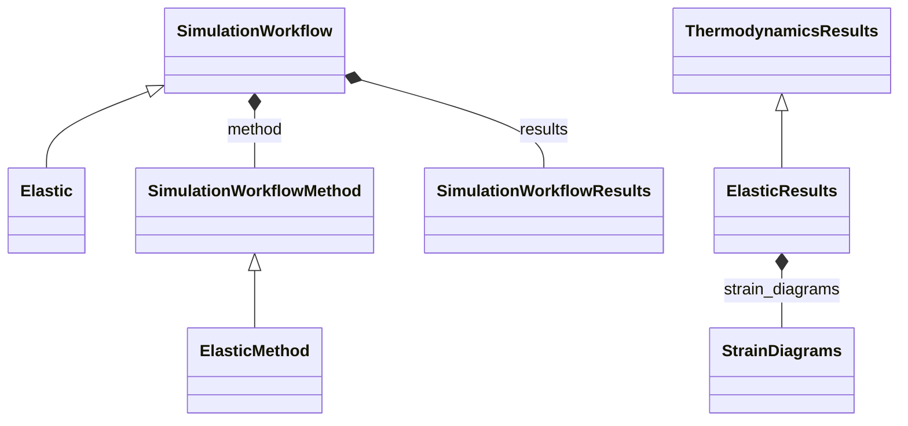

# Elastic Workflow

**Purpose:** Elastic-constant workflow with thermodynamics-derived result structures

**In scope:**

- Elastic inheritance from SimulationWorkflow
- Elastic method specialization and strain-diagram result containers
- ElasticResults inheritance through ThermodynamicsResults

## Relationship map

Legend

<svg class="uml-legend__swatch" viewBox="0 0 64 16" aria-hidden="true"><line class="uml-legend__line" x1="54" y1="8" x2="22" y2="8"/><path class="uml-legend__head uml-legend__head--open" d="M10 8 L22 2 L22 14 Z"/></svg>inheritance (is-a)

<svg class="uml-legend__swatch" viewBox="0 0 64 16" aria-hidden="true"><path class="uml-legend__head uml-legend__head--filled" d="M10 8 L16 2 L22 8 L16 14 Z"/><line class="uml-legend__line" x1="22" y1="8" x2="52" y2="8"/></svg>composition (has-a)

## Quantities by Key Sections

### `SimulationWorkflow`

| Section | Description | MetaInfo |
|---|---|---|
| `SimulationWorkflow` | Base class for simulation workflows. | [Open in MetaInfo browser](https://nomad-lab.eu/prod/v1/develop/gui/analyze/metainfo/nomad_simulations/section_definitions@nomad_simulations.schema_packages.workflow.general.SimulationWorkflow){:target="_blank"} |

*This section has no direct quantities.*

### `SimulationWorkflowMethod`

| Section | Description | MetaInfo |
|---|---|---|
| `SimulationWorkflowMethod` |  | [Open in MetaInfo browser](https://nomad-lab.eu/prod/v1/develop/gui/analyze/metainfo/nomad_simulations/section_definitions@nomad_simulations.schema_packages.workflow.general.SimulationWorkflowMethod){:target="_blank"} |

*This section has no direct quantities.*

### `ThermodynamicsResults`

| Section | Description | MetaInfo |
|---|---|---|
| `ThermodynamicsResults` |  | [Open in MetaInfo browser](https://nomad-lab.eu/prod/v1/develop/gui/analyze/metainfo/nomad_simulations/section_definitions@nomad_simulations.schema_packages.workflow.thermodynamics.ThermodynamicsResults){:target="_blank"} |

*This section has no direct quantities.*

### `Elastic`

| Section | Description | MetaInfo |
|---|---|---|
| `Elastic` | Definitions for an elastic workflow. | [Open in MetaInfo browser](https://nomad-lab.eu/prod/v1/develop/gui/analyze/metainfo/nomad_simulations/section_definitions@nomad_simulations.schema_packages.workflow.elastic.Elastic){:target="_blank"} |

*This section has no direct quantities.*

### `ElasticMethod`

| Section | Description | MetaInfo |
|---|---|---|
| `ElasticMethod` |  | [Open in MetaInfo browser](https://nomad-lab.eu/prod/v1/develop/gui/analyze/metainfo/nomad_simulations/section_definitions@nomad_simulations.schema_packages.workflow.elastic.ElasticMethod){:target="_blank"} |

| Quantity | Type | Description |
|---|---|---|
| `program` | Reference | Program used to calculate the energies. |
| `calculation_method` | m_str(str) | Method used to calculate elastic constants, can either be energy or stress. |
| `elastic_constants_order` | m_int32(int) | Order of the calculated elastic constants. |
| `fitting_error_maximum` | m_float64(float64) | Maximum error in polynomial fit. |
| `strain_maximum` | m_float64(float64) | Maximum strain applied to crystal. |

### `ElasticResults`

| Section | Description | MetaInfo |
|---|---|---|
| `ElasticResults` |  | [Open in MetaInfo browser](https://nomad-lab.eu/prod/v1/develop/gui/analyze/metainfo/nomad_simulations/section_definitions@nomad_simulations.schema_packages.workflow.elastic.ElasticResults){:target="_blank"} |

| Quantity | Type | Description |
|---|---|---|
| `n_deformations` | m_int32(int32) | Number of deformed structures used to calculate the elastic constants. This is determined by the symmetry of the crystal. |
| `deformation_types` | m_str(str_) (shape: ['n_deformations', 6]) | deformation types |
| `n_strains` | m_int32(int32) | number of equally spaced strains applied to each deformed structure, which are generated between the maximum negative strain and the maximum positive one. |
| `is_mechanically_stable` | m_bool(bool) | Indicates if structure is mechanically stable from the calculated values of the elastic constants. |
| `elastic_constants_notation_matrix_second_order` | m_str(str_) (shape: [6, 6]) | Symmetry of the second-order elastic constant matrix in Voigt notation |
| `elastic_constants_matrix_second_order` | m_float64(float64) (shape: [6, 6]) | 2nd order elastic constant (stiffness) matrix in pascals |
| `elastic_constants_matrix_third_order` | m_float64(float64) (shape: [6, 6, 6]) | 3rd order elastic constant (stiffness) matrix in pascals |
| `compliance_matrix_second_order` | m_float64(float64) (shape: [6, 6]) | Elastic compliance matrix in 1/GPa |
| `elastic_constants_gradient_matrix_second_order` | m_float64(float64) (shape: [18, 18]) | gradient of the 2nd order elastic constant (stiffness) matrix in newton |
| `bulk_modulus_voigt` | m_float64(float64) | Voigt bulk modulus |
| `shear_modulus_voigt` | m_float64(float64) | Voigt shear modulus |
| `bulk_modulus_reuss` | m_float64(float64) | Reuss bulk modulus |
| `shear_modulus_reuss` | m_float64(float64) | Reuss shear modulus |
| `bulk_modulus_hill` | m_float64(float64) | Hill bulk modulus |
| `shear_modulus_hill` | m_float64(float64) | Hill shear modulus |
| `young_modulus_voigt` | m_float64(float64) | Voigt Young modulus |
| `poisson_ratio_voigt` | m_float64(float64) | Voigt Poisson ratio |
| `young_modulus_reuss` | m_float64(float64) | Reuss Young modulus |
| `poisson_ratio_reuss` | m_float64(float64) | Reuss Poisson ratio |
| `young_modulus_hill` | m_float64(float64) | Hill Young modulus |
| `poisson_ratio_hill` | m_float64(float64) | Hill Poisson ratio |
| `elastic_anisotropy` | m_float64(float64) | Elastic anisotropy |
| `pugh_ratio_hill` | m_float64(float64) | Pugh ratio defined as the ratio between the shear modulus and bulk modulus |
| `debye_temperature` | m_float64(float64) | Debye temperature |
| `speed_sound_transverse` | m_float64(float64) | Speed of sound along the transverse direction |
| `speed_sound_longitudinal` | m_float64(float64) | Speed of sound along the longitudinal direction |
| `speed_sound_average` | m_float64(float64) | Average speed of sound |
| `eigenvalues_elastic` | m_float64(float64) (shape: [6]) | Eigenvalues of the stiffness matrix |

### `StrainDiagrams`

| Section | Description | MetaInfo |
|---|---|---|
| `StrainDiagrams` | Section containing the information regarding the elastic strains. | [Open in MetaInfo browser](https://nomad-lab.eu/prod/v1/develop/gui/analyze/metainfo/nomad_simulations/section_definitions@nomad_simulations.schema_packages.workflow.elastic.StrainDiagrams){:target="_blank"} |

| Quantity | Type | Description |
|---|---|---|
| `type` | m_str(str) | Kind of strain diagram. Possible values are: energy; cross-validation (cross- validation error); d2E (second derivative of the energy wrt the strain) |
| `n_eta` | m_int32(int32) | Number of strain values used in the strain diagram |
| `n_deformations` | m_int32(int32) | Number of deformations. |
| `value` | m_float64(float64) (shape: ['n_deformations', 'n_eta']) | Values of the energy(units:J)/d2E(units:Pa)/cross-validation (depending on the value of strain_diagram_type) |
| `eta` | m_float64(float64) (shape: ['n_deformations', 'n_eta']) | eta values used the strain diagrams |
| `stress_voigt_component` | m_int32(int32) | Voigt component corresponding to the strain diagram |
| `polynomial_fit_order` | m_int32(int32) | Order of the polynomial fit |

## Related Pages

- [Workflow Overview](../explanation/workflow/overview.md)
