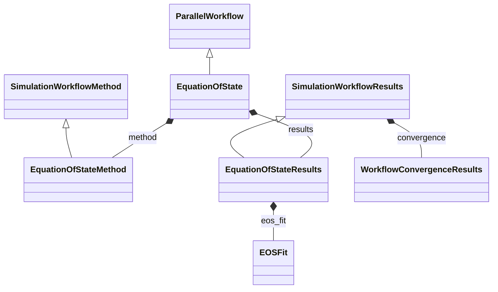

# Equation of State Workflow

**Purpose:** Parallel equation-of-state workflow with EOS fitting results

**In scope:**

- EquationOfState inheritance from ParallelWorkflow
- EOS method specialization and EOSFit result subsections
- Parallel workflow pattern for volume/energy scan calculations

## Relationship map

Legend

<svg class="uml-legend__swatch" viewBox="0 0 64 16" aria-hidden="true"><line class="uml-legend__line" x1="54" y1="8" x2="22" y2="8"/><path class="uml-legend__head uml-legend__head--open" d="M10 8 L22 2 L22 14 Z"/></svg>inheritance (is-a)

<svg class="uml-legend__swatch" viewBox="0 0 64 16" aria-hidden="true"><path class="uml-legend__head uml-legend__head--filled" d="M10 8 L16 2 L22 8 L16 14 Z"/><line class="uml-legend__line" x1="22" y1="8" x2="52" y2="8"/></svg>composition (has-a)

## Quantities by Key Sections

### `ParallelWorkflow`

| Section | Description | MetaInfo |
|---|---|---|
| `ParallelWorkflow` | Base class for workflows where tasks are executed concurrently. | [Open in MetaInfo browser](https://nomad-lab.eu/prod/v1/develop/gui/analyze/metainfo/nomad_simulations/section_definitions@nomad_simulations.schema_packages.workflow.general.ParallelWorkflow){:target="_blank"} |

*This section has no direct quantities.*

### `SimulationWorkflowMethod`

| Section | Description | MetaInfo |
|---|---|---|
| `SimulationWorkflowMethod` |  | [Open in MetaInfo browser](https://nomad-lab.eu/prod/v1/develop/gui/analyze/metainfo/nomad_simulations/section_definitions@nomad_simulations.schema_packages.workflow.general.SimulationWorkflowMethod){:target="_blank"} |

*This section has no direct quantities.*

### `SimulationWorkflowResults`

| Section | Description | MetaInfo |
|---|---|---|
| `SimulationWorkflowResults` | Base class for simulation workflow results sub-section definition. | [Open in MetaInfo browser](https://nomad-lab.eu/prod/v1/develop/gui/analyze/metainfo/nomad_simulations/section_definitions@nomad_simulations.schema_packages.workflow.general.SimulationWorkflowResults){:target="_blank"} |

| Quantity | Type | Description |
|---|---|---|
| `finished_normally` | m_bool(bool) | Indicates if calculation terminated normally. |
| `is_converged` | m_bool(bool) | Represents if the convergence targets have been reached (True) or not (False). |

### `EquationOfState`

| Section | Description | MetaInfo |
|---|---|---|
| `EquationOfState` | Definitions for equation of state workflow. | [Open in MetaInfo browser](https://nomad-lab.eu/prod/v1/develop/gui/analyze/metainfo/nomad_simulations/section_definitions@nomad_simulations.schema_packages.workflow.equation_of_state.EquationOfState){:target="_blank"} |

*This section has no direct quantities.*

### `EquationOfStateMethod`

| Section | Description | MetaInfo |
|---|---|---|
| `EquationOfStateMethod` |  | [Open in MetaInfo browser](https://nomad-lab.eu/prod/v1/develop/gui/analyze/metainfo/nomad_simulations/section_definitions@nomad_simulations.schema_packages.workflow.equation_of_state.EquationOfStateMethod){:target="_blank"} |

| Quantity | Type | Description |
|---|---|---|
| `program` | Reference | Program used to calculate the energies. |

### `EquationOfStateResults`

| Section | Description | MetaInfo |
|---|---|---|
| `EquationOfStateResults` |  | [Open in MetaInfo browser](https://nomad-lab.eu/prod/v1/develop/gui/analyze/metainfo/nomad_simulations/section_definitions@nomad_simulations.schema_packages.workflow.equation_of_state.EquationOfStateResults){:target="_blank"} |

| Quantity | Type | Description |
|---|---|---|
| `n_points` | m_int32(int32) | Number of volume-energy pairs in data. |
| `volumes` | m_float64(float64) (shape: ['n_points']) | Array of volumes per atom for which the energies are evaluated. |
| `energies` | m_float64(float64) (shape: ['n_points']) | Array of energies corresponding to each volume. |

### `EOSFit`

| Section | Description | MetaInfo |
|---|---|---|
| `EOSFit` | Section containing results of an equation of state fit. | [Open in MetaInfo browser](https://nomad-lab.eu/prod/v1/develop/gui/analyze/metainfo/nomad_simulations/section_definitions@nomad_simulations.schema_packages.workflow.equation_of_state.EOSFit){:target="_blank"} |

| Quantity | Type | Description |
|---|---|---|
| `function_name` | Enum | Specifies the function used to perform the fitting of the volume-energy data. Value can be one of birch_euler, birch_lagrange, birch_murnaghan, mie_gruneisen, murnaghan, pack_evans_james, poirier_tarantola, tait, vinet. |
| `fitted_energies` | m_float64(float64) (shape: ['*']) | Array of the fitted energies corresponding to each volume. |
| `bulk_modulus` | m_float64(float64) | Calculated value of the bulk modulus by fitting the volume-energy data. |
| `bulk_modulus_derivative` | m_float64(float64) | Calculated value of the pressure derivative of the bulk modulus. |
| `equilibrium_volume` | m_float64(float64) | Calculated value of the equilibrium volume by fitting the volume-energy data. |
| `equilibrium_energy` | m_float64(float64) | Calculated value of the equilibrium energy by fitting the volume-energy data. |
| `rms_error` | m_float64(float64) | Root-mean squared value of the error in the fitting. |

## Related Pages

- [Workflow Overview](../explanation/workflow/overview.md)
