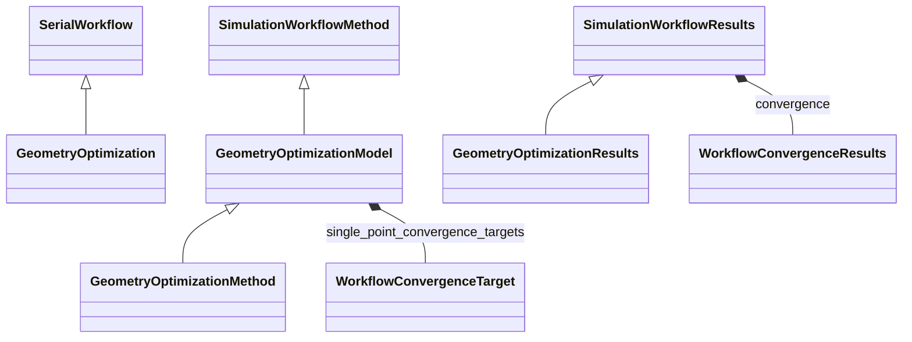

# Geometry Optimization Workflow

**Purpose:** Geometry-optimization workflow with convergence-aware method/results modeling

**In scope:**

- GeometryOptimization inheritance from SerialWorkflow
- GeometryOptimization model and method specialization layers
- Workflow and nested single-point convergence configuration/results integration

## Relationship map

Legend

<svg class="uml-legend__swatch" viewBox="0 0 64 16" aria-hidden="true"><line class="uml-legend__line" x1="54" y1="8" x2="22" y2="8"/><path class="uml-legend__head uml-legend__head--open" d="M10 8 L22 2 L22 14 Z"/></svg>inheritance (is-a)

<svg class="uml-legend__swatch" viewBox="0 0 64 16" aria-hidden="true"><path class="uml-legend__head uml-legend__head--filled" d="M10 8 L16 2 L22 8 L16 14 Z"/><line class="uml-legend__line" x1="22" y1="8" x2="52" y2="8"/></svg>composition (has-a)

## Quantities by Key Sections

### `SerialWorkflow`

| Section | Description | MetaInfo |
|---|---|---|
| `SerialWorkflow` | Base class for workflows where tasks are executed sequentially. | [Open in MetaInfo browser](https://nomad-lab.eu/prod/v1/develop/gui/analyze/metainfo/nomad_simulations/section_definitions@nomad_simulations.schema_packages.workflow.general.SerialWorkflow){:target="_blank"} |

*This section has no direct quantities.*

### `SimulationWorkflowMethod`

| Section | Description | MetaInfo |
|---|---|---|
| `SimulationWorkflowMethod` |  | [Open in MetaInfo browser](https://nomad-lab.eu/prod/v1/develop/gui/analyze/metainfo/nomad_simulations/section_definitions@nomad_simulations.schema_packages.workflow.general.SimulationWorkflowMethod){:target="_blank"} |

*This section has no direct quantities.*

### `SimulationWorkflowResults`

| Section | Description | MetaInfo |
|---|---|---|
| `SimulationWorkflowResults` | Base class for simulation workflow results sub-section definition. | [Open in MetaInfo browser](https://nomad-lab.eu/prod/v1/develop/gui/analyze/metainfo/nomad_simulations/section_definitions@nomad_simulations.schema_packages.workflow.general.SimulationWorkflowResults){:target="_blank"} |

| Quantity | Type | Description |
|---|---|---|
| `finished_normally` | m_bool(bool) | Indicates if calculation terminated normally. |
| `is_converged` | m_bool(bool) | Represents if the convergence targets have been reached (True) or not (False). |

### `WorkflowConvergenceTarget`

| Section | Description | MetaInfo |
|---|---|---|
| `WorkflowConvergenceTarget` | Base section for defining convergence targets. | [Open in MetaInfo browser](https://nomad-lab.eu/prod/v1/develop/gui/analyze/metainfo/nomad_simulations/section_definitions@nomad_simulations.schema_packages.workflow.general.WorkflowConvergenceTarget){:target="_blank"} |

| Quantity | Type | Description |
|---|---|---|
| `threshold` | m_float_bounded(float) | 

Convergence threshold.
Convergence threshold. Must be non-negative. When threshold_type is 'relative', must be dimensionless. When threshold_type is 'absolute', 'maximum', or 'rms', must have physical units. Child classes override this to add convergence path annotations.
 |
| `threshold_type` | Enum | 

Specifies the mathematical method used to evaluate convergence between successive iterations.
Specifies the mathematical method used to evaluate convergence between successive iterations. Supported methods include: \| Name \| Description \| \| --------- \| -------------------------------- \| \| `'absolute'` \| Difference in absolute terms between two subsequent iterations (e.g., \\|E(n) - E(n-1)\\|). Most common for energy convergence. \| \| `'relative'` \| Difference as a fraction of the total property value (e.g., \\|E(n) - E(n-1)\\|/\\|E(n)\\|). Useful when the magnitude of the property varies widely across systems. \| \| `'maximum'` \| Maximum absolute difference across the whole quantity data (e.g., max(\\|\\|F_i(n) - F_i(n-1)\\|\\|) for forces). Suitable for vector quantities like forces or stress tensor elements. \| \| `'rms'` \| Root mean square of the dataset as a whole (e.g., sqrt(sum(\\|\\|F_i(n) - F_i(n-1)\\|\\|²)/N)). Provides a statistical measure of overall convergence for multi-component properties. \| Note: 'relative' requires dimensionless threshold; other types require physical units matching the property. The mode used affects both convergence behavior and computational efficiency. Different codes may default to different comparison modes for the same physical property.
 |

### `GeometryOptimization`

| Section | Description | MetaInfo |
|---|---|---|
| `GeometryOptimization` | Definitions for geometry optimization workflow. | [Open in MetaInfo browser](https://nomad-lab.eu/prod/v1/develop/gui/analyze/metainfo/nomad_simulations/section_definitions@nomad_simulations.schema_packages.workflow.geometry_optimization.GeometryOptimization){:target="_blank"} |

*This section has no direct quantities.*

### `GeometryOptimizationModel`

| Section | Description | MetaInfo |
|---|---|---|
| `GeometryOptimizationModel` | Workflow model describing a geometry optimization. | [Open in MetaInfo browser](https://nomad-lab.eu/prod/v1/develop/gui/analyze/metainfo/nomad_simulations/section_definitions@nomad_simulations.schema_packages.workflow.geometry_optimization.GeometryOptimizationModel){:target="_blank"} |

| Quantity | Type | Description |
|---|---|---|
| `optimization_type` | Enum | 

The type of geometry optimization, which denotes what is being optimized.
The type of geometry optimization, which denotes what is being optimized. Allowed values are: \| Type                   \| Description                               \| \| ---------------------- \| ----------------------------------------- \| \| `"static"`             \| no optimization \| \| `"atomic"`             \| the atomic coordinates alone are updated \| \| `"cell_volume"`         \| `"atomic"` + cell lattice parameters are updated isotropically \| \| `"cell_shape"`        \| `"cell_volume"` but without the isotropic constraint: all cell parameters are updated \|
 |
| `optimization_method` | m_str(str) | The method used for geometry optimization. Some known possible values are: `"steepest_descent"`, `"conjugate_gradient"`, `"low_memory_broyden_fletcher_goldfarb_shanno"`. |
| `n_steps_maximum` | m_int32(int) | Maximum number of optimization steps. |
| `sampling_frequency` | m_int32(int) | The number of optimization steps between saved outputs. |

### `GeometryOptimizationMethod`

| Section | Description | MetaInfo |
|---|---|---|
| `GeometryOptimizationMethod` |  | [Open in MetaInfo browser](https://nomad-lab.eu/prod/v1/develop/gui/analyze/metainfo/nomad_simulations/section_definitions@nomad_simulations.schema_packages.workflow.geometry_optimization.GeometryOptimizationMethod){:target="_blank"} |

*This section has no direct quantities.*

### `GeometryOptimizationResults`

| Section | Description | MetaInfo |
|---|---|---|
| `GeometryOptimizationResults` |  | [Open in MetaInfo browser](https://nomad-lab.eu/prod/v1/develop/gui/analyze/metainfo/nomad_simulations/section_definitions@nomad_simulations.schema_packages.workflow.geometry_optimization.GeometryOptimizationResults){:target="_blank"} |

| Quantity | Type | Description |
|---|---|---|
| `is_single_point_converged` | m_bool(bool) | 

Aggregated SCF convergence status across all optimization steps.
Aggregated SCF convergence status across all optimization steps. Returns True if all SCF runs in all optimization steps converged to their specified targets (defined in `method.single_point_convergence_targets`). Returns False if any SCF run failed to converge. Returns None if no convergence data is available. This value is computed during normalization by aggregating convergence results from all SinglePoint tasks using the JMESPath query: `workflow2.tasks[*].results.convergence[*].is_reached` The aggregation logic is: `all(all(step_results) for step_results in all_results)` Example: For a geometry optimization with 3 steps: - Step 0: [True, True] (2 SCF targets, both converged) - Step 1: [True, True] - Step 2: [True, False] (second target failed) → is_single_point_converged = False Note: This field currently provides only aggregate information. Per-step convergence status should be retrieved from individual task results: `workflow2.tasks[step_index].results.convergence` See also: - `method.single_point_convergence_targets`: SCF convergence criteria - `is_converged`: Geometry-level convergence status - `convergence`: Per-target geometry convergence results
 |
| `n_steps` | m_int32(int) | Number of saved optimization steps. |
| `energies` | m_float64(float64) (shape: ['n_steps']) | List of energy_total values gathered from the single configuration calculations that are a part of the optimization trajectory. |
| `steps` | m_int32(int32) (shape: ['n_steps']) | The step index corresponding to each saved configuration. |
| `final_energy_difference` | m_float64(float64) | The difference in the energy_total between the last two steps during optimization. |
| `final_force_maximum` | m_float64(float64) | The maximum net force in the last optimization step. |
| `final_displacement_maximum` | m_float64(float64) | The maximum displacement in the last optimization step with respect to previous. |

## Related Pages

- [Convergence Targets: Schema Traversal Guide](../explanation/workflow/convergence.md)
- [Workflow Overview](../explanation/workflow/overview.md)
