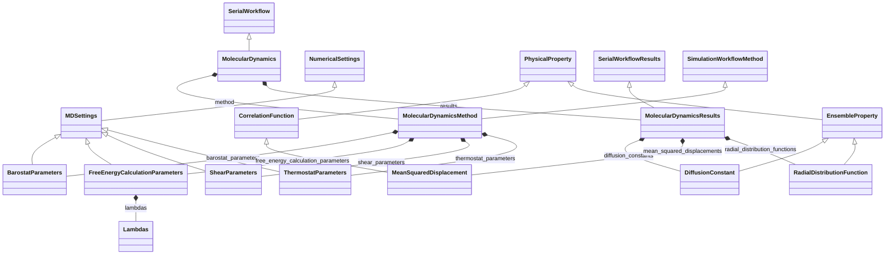

# Molecular Dynamics Workflow

**Purpose:** Molecular-dynamics workflow with thermostat/barostat/shear settings and ensemble outputs

**In scope:**

- MolecularDynamics inheritance from SerialWorkflow
- Method-side MD control settings (thermostat, barostat, shear, free-energy)
- Results-side ensemble/correlation properties and trajectory observables
- Cross-domain anchors to NumericalSettings and PhysicalProperty for hierarchy context

## Relationship map

Legend

<svg class="uml-legend__swatch" viewBox="0 0 64 16" aria-hidden="true"><line class="uml-legend__line" x1="54" y1="8" x2="22" y2="8"/><path class="uml-legend__head uml-legend__head--open" d="M10 8 L22 2 L22 14 Z"/></svg>inheritance (is-a)

<svg class="uml-legend__swatch" viewBox="0 0 64 16" aria-hidden="true"><path class="uml-legend__head uml-legend__head--filled" d="M10 8 L16 2 L22 8 L16 14 Z"/><line class="uml-legend__line" x1="22" y1="8" x2="52" y2="8"/></svg>composition (has-a)

## Key sections

| Section | Description | MetaInfo |
|---|---|---|
| `SerialWorkflow` | Base class for workflows where tasks are executed sequentially. | [Open in MetaInfo browser](https://nomad-lab.eu/prod/v1/develop/gui/analyze/metainfo/nomad_simulations/section_definitions@nomad_simulations.schema_packages.workflow.general.SerialWorkflow){:target="_blank"} |
| `SerialWorkflowResults` |  | [Open in MetaInfo browser](https://nomad-lab.eu/prod/v1/develop/gui/analyze/metainfo/nomad_simulations/section_definitions@nomad_simulations.schema_packages.workflow.general.SerialWorkflowResults){:target="_blank"} |
| `SimulationWorkflowMethod` |  | [Open in MetaInfo browser](https://nomad-lab.eu/prod/v1/develop/gui/analyze/metainfo/nomad_simulations/section_definitions@nomad_simulations.schema_packages.workflow.general.SimulationWorkflowMethod){:target="_blank"} |
| `NumericalSettings` | A base section used to define how a chosen `ModelMethod` is realized numerically in a simulation. | [Open in MetaInfo browser](https://nomad-lab.eu/prod/v1/develop/gui/analyze/metainfo/nomad_simulations/section_definitions@nomad_simulations.schema_packages.numerical_settings.NumericalSettings){:target="_blank"} |
| `PhysicalProperty` | A base section for computational output properties, containing all relevant (meta)data. | [Open in MetaInfo browser](https://nomad-lab.eu/prod/v1/develop/gui/analyze/metainfo/nomad_simulations/section_definitions@nomad_simulations.schema_packages.physical_property.PhysicalProperty){:target="_blank"} |
| `MDSettings` | Abstract class for classifying numerical settings relevant for molecular dynamics runs. | [Open in MetaInfo browser](https://nomad-lab.eu/prod/v1/develop/gui/analyze/metainfo/nomad_simulations/section_definitions@nomad_simulations.schema_packages.workflow.molecular_dynamics.MDSettings){:target="_blank"} |
| `ThermostatParameters` | Section containing the parameters pertaining to the thermostat for a molecular dynamics run. | [Open in MetaInfo browser](https://nomad-lab.eu/prod/v1/develop/gui/analyze/metainfo/nomad_simulations/section_definitions@nomad_simulations.schema_packages.workflow.molecular_dynamics.ThermostatParameters){:target="_blank"} |
| `BarostatParameters` | Section containing the parameters pertaining to the barostat for a molecular dynamics run. | [Open in MetaInfo browser](https://nomad-lab.eu/prod/v1/develop/gui/analyze/metainfo/nomad_simulations/section_definitions@nomad_simulations.schema_packages.workflow.molecular_dynamics.BarostatParameters){:target="_blank"} |
| `ShearParameters` | Section containing the parameters pertaining to the shear flow for a molecular dynamics run. | [Open in MetaInfo browser](https://nomad-lab.eu/prod/v1/develop/gui/analyze/metainfo/nomad_simulations/section_definitions@nomad_simulations.schema_packages.workflow.molecular_dynamics.ShearParameters){:target="_blank"} |
| `FreeEnergyCalculationParameters` | Parameters for a free energy workflow run. | [Open in MetaInfo browser](https://nomad-lab.eu/prod/v1/develop/gui/analyze/metainfo/nomad_simulations/section_definitions@nomad_simulations.schema_packages.workflow.molecular_dynamics.FreeEnergyCalculationParameters){:target="_blank"} |
| `Lambdas` | Parameters for one lambda dimension / interaction type. | [Open in MetaInfo browser](https://nomad-lab.eu/prod/v1/develop/gui/analyze/metainfo/nomad_simulations/section_definitions@nomad_simulations.schema_packages.workflow.molecular_dynamics.Lambdas){:target="_blank"} |
| `EnsembleProperty` | Abstract base section for static observables calculated from a trajectory (i.e., from an ensemble average). | [Open in MetaInfo browser](https://nomad-lab.eu/prod/v1/develop/gui/analyze/metainfo/nomad_simulations/section_definitions@nomad_simulations.schema_packages.workflow.molecular_dynamics.EnsembleProperty){:target="_blank"} |
| `CorrelationFunction` | Abstract base section for time correlation functions calculated from a trajectory. | [Open in MetaInfo browser](https://nomad-lab.eu/prod/v1/develop/gui/analyze/metainfo/nomad_simulations/section_definitions@nomad_simulations.schema_packages.workflow.molecular_dynamics.CorrelationFunction){:target="_blank"} |
| `RadialDistributionFunction` | Section containing information about the calculation of radial distribution functions (rdfs). | [Open in MetaInfo browser](https://nomad-lab.eu/prod/v1/develop/gui/analyze/metainfo/nomad_simulations/section_definitions@nomad_simulations.schema_packages.workflow.molecular_dynamics.RadialDistributionFunction){:target="_blank"} |
| `DiffusionConstant` | Section containing information regarding the diffusion constants. | [Open in MetaInfo browser](https://nomad-lab.eu/prod/v1/develop/gui/analyze/metainfo/nomad_simulations/section_definitions@nomad_simulations.schema_packages.workflow.molecular_dynamics.DiffusionConstant){:target="_blank"} |
| `MeanSquaredDisplacement` | Section containing information about a calculation of any mean squared displacements (msds). | [Open in MetaInfo browser](https://nomad-lab.eu/prod/v1/develop/gui/analyze/metainfo/nomad_simulations/section_definitions@nomad_simulations.schema_packages.workflow.molecular_dynamics.MeanSquaredDisplacement){:target="_blank"} |
| `MolecularDynamics` |  | [Open in MetaInfo browser](https://nomad-lab.eu/prod/v1/develop/gui/analyze/metainfo/nomad_simulations/section_definitions@nomad_simulations.schema_packages.workflow.molecular_dynamics.MolecularDynamics){:target="_blank"} |
| `MolecularDynamicsMethod` |  | [Open in MetaInfo browser](https://nomad-lab.eu/prod/v1/develop/gui/analyze/metainfo/nomad_simulations/section_definitions@nomad_simulations.schema_packages.workflow.molecular_dynamics.MolecularDynamicsMethod){:target="_blank"} |
| `MolecularDynamicsResults` |  | [Open in MetaInfo browser](https://nomad-lab.eu/prod/v1/develop/gui/analyze/metainfo/nomad_simulations/section_definitions@nomad_simulations.schema_packages.workflow.molecular_dynamics.MolecularDynamicsResults){:target="_blank"} |

## Quantities by section

### `SerialWorkflow`

*This section has no direct quantities.*

### `SerialWorkflowResults`

*This section has no direct quantities.*

### `SimulationWorkflowMethod`

*This section has no direct quantities.*

### `NumericalSettings`

| Quantity | Type | Description |
|---|---|---|
| `name` | m_str(str) | Name of the numerical settings section. This is typically used for easy identification of the `NumericalSettings` section within a `ModelMethod`. Possible values: "KMesh", "FrequencyMesh", "TimeMesh", "SelfConsistency", "BasisSet". |

### `PhysicalProperty`

| Quantity | Type | Description |
|---|---|---|
| `name` | m_str(str) | Name of the physical property. Example: `'ElectronicBandGap'`. |
| `iri` | URL | Internationalized Resource Identifier (IRI) pointing to a definition, typically within a larger, ontological framework. |
| `type` | m_str(str) | Type categorization of the physical property. Example: an `ElectronicBandGap` can be `'direct'` or `'indirect'`. |
| `contribution_type` | m_str(str) | Type of contribution to the physical property. Hence, only applies to `contributions` instances. Example: `TotalEnergy` may have contributions like _kinetic_, _potential_, etc. |
| `label` | m_str(str) | Label for additional classification of the physical property. Example: an `ElectronicBandGap` can be labeled as `'DFT'` or `'GW'` depending on the methodology used to calculate it. |
| `entity_ref` | Reference | 

Reference to the entity that the physical property refers to.
Reference to the entity that the physical property refers to. Examples: - a simulated physical property might refer to the macroscopic system or instead of a specific atom in the unit cell. In the first case, `outputs.model_system_ref` (see outputs.py) will point to the `ModelSystem` section, while in the second case, `entity_ref` will point to `AtomsState` section (see atoms_state.py).
 |
| `is_derived` | m_bool(bool) | 

Flag indicating whether the physical property is derived from other physical properties.
Flag indicating whether the physical property is derived from other physical properties. We make the distinction between directly parsed and derived physical properties: - Directly parsed: the physical property is directly parsed from the simulation output files. - Derived: the physical property is derived from other physical properties. No extra numerical settings are required to calculate the physical property.
 |
| `physical_property_ref` | Reference | Reference to the `PhysicalProperty` section from which the physical property was derived. If `physical_property_ref` is populated, the quantity `is_derived` is set to True via normalization. |
| `is_converged` | m_bool(bool) | Flag indicating whether the calculation that yields this physical property is converged or not after a SCF or optimization process. This information is obtained from the workflow section. |

### `MDSettings`

| Quantity | Type | Description |
|---|---|---|
| `frame_start` | m_int32(int) | Trajectory frame number where the application of these settings start. |
| `frame_end` | m_int32(int) | Trajectory frame number where the application of these settings end. |

### `ThermostatParameters`

| Quantity | Type | Description |
|---|---|---|
| `thermostat_type` | Enum | 

The name of the thermostat used for temperature control.
The name of the thermostat used for temperature control. If skipped or an empty string is used, it means no thermostat was applied. Allowed values are: \| Thermostat Name        \| Description                               \| \| ---------------------- \| ----------------------------------------- \| \| `""`                   \| No thermostat               \| \| `"andersen"`           \| H.C. Andersen, [J. Chem. Phys. **72**, 2384 (1980)](https://doi.org/10.1063/1.439486) \| \| `"berendsen"`          \| H. J. C. Berendsen, J. P. M. Postma, W. F. van Gunsteren, A. DiNola, and J. R. Haak, [J. Chem. Phys. **81**, 3684 (1984)](https://doi.org/10.1063/1.448118) \| \| `"brownian"`           \| Brownian Dynamics \| \| `"dissipative_particle_dynamics"` \| R.D. Groot and P.B. Warren [J. Chem. Phys. **107**(11), 4423-4435 (1997)](https://doi.org/10.1063/1.474784) \| \| `"langevin_goga"`           \| N. Goga, A. J. Rzepiela, A. H. de Vries, S. J. Marrink, and H. J. C. Berendsen, [J. Chem. Theory Comput. **8**, 3637 (2012)] (https://doi.org/10.1021/ct3000876) \| \| `"langevin_leap_frog"` \| J.A. Izaguirre, C.R. Sweet, and V.S. Pande [Pac Symp Biocomput. **15**, 240-251 (2010)](https://doi.org/10.1142/9789814295291_0026) \| \| `"langevin_schneider"`           \| T. Schneider and E. Stoll, [Phys. Rev. B **17**, 1302](https://doi.org/10.1103/PhysRevB.17.1302) \| \| `"nose_hoover"`        \| S. Nosé, [Mol. Phys. **52**, 255 (1984)] (https://doi.org/10.1080/00268978400101201); W.G. Hoover, [Phys. Rev. A **31**, 1695 (1985) \| \| `"velocity_rescaling"` \| G. Bussi, D. Donadio, and M. Parrinello, [J. Chem. Phys. **126**, 014101 (2007)](https://doi.org/10.1063/1.2408420) \| \| `"velocity_rescaling_langevin"` \| G. Bussi and M. Parrinello, [Phys. Rev. E **75**, 056707 (2007)](https://doi.org/10.1103/PhysRevE.75.056707) \| \| `"velocity_rescaling_woodcock"` \| L. V. Woodcock, [Chem. Phys. Lett. **10**, 257 (1971)](https://doi.org/10.1016/0009-2614(71)80281-6) \|
 |
| `reference_temperature` | m_float64(float64) | The target temperature for the simulation. Typically used when temperature_profile is "constant". |
| `coupling_constant` | m_float64(float64) | The time constant for temperature coupling. Need to describe what this means for the various thermostat options... |
| `effective_mass` | m_float64(float64) | The effective or fictitious mass of the temperature resevoir. |
| `temperature_profile` | Enum | Type of temperature control (i.e., annealing) procedure. Can be "constant" (no annealing), "linear", or "exponential". If linear, "temperature_update_delta" specifies the corresponding update parameter. If exponential, "temperature_update_factor" specifies the corresponding update parameter. |
| `reference_temperature_start` | m_float64(float64) | The initial target temperature for the simulation. Typically used when temperature_profile is "linear" or "exponential". |
| `reference_temperature_end` | m_float64(float64) | The final target temperature for the simulation.  Typically used when temperature_profile is "linear" or "exponential". |
| `temperature_update_frequency` | m_int32(int) | Number of simulation steps between changing the target temperature. |
| `temperature_update_delta` | m_float64(float64) | Amount to be added (subtracted if negative) to the current reference_temperature at a frequency of temperature_update_frequency when temperature_profile is "linear". The reference temperature is then replaced by this new value until the next update. |
| `temperature_update_factor` | m_float64(float64) | Factor to be multiplied to the current reference_temperature at a frequency of temperature_update_frequency when temperature_profile is exponential. The reference temperature is then replaced by this new value until the next update. |
| `step_start` | m_int32(int) | Trajectory step where this thermostating starts. |
| `step_end` | m_int32(int) | Trajectory step number where this thermostating ends. |

### `BarostatParameters`

| Quantity | Type | Description |
|---|---|---|
| `barostat_type` | Enum | 

The name of the barostat used for temperature control.
The name of the barostat used for temperature control. If skipped or an empty string is used, it means no barostat was applied. Allowed values are: \| Barostat Name          \| Description                               \| \| ---------------------- \| ----------------------------------------- \| \| `""`                   \| No thermostat               \| \| `"berendsen"`          \| H. J. C. Berendsen, J. P. M. Postma, W. F. van Gunsteren, A. DiNola, and J. R. Haak, [J. Chem. Phys. **81**, 3684 (1984)](https://doi.org/10.1063/1.448118) \| \| `"martyna_tuckerman_tobias_klein"` \| G.J. Martyna, M.E. Tuckerman, D.J. Tobias, and M.L. Klein, [Mol. Phys. **87**, 1117 (1996)](https://doi.org/10.1080/00268979600100761); M.E. Tuckerman, J. Alejandre, R. López-Rendón, A.L. Jochim, and G.J. Martyna, [J. Phys. A. **59**, 5629 (2006)](https://doi.org/10.1088/0305-4470/39/19/S18)\| \| `"nose_hoover"`        \| S. Nosé, [Mol. Phys. **52**, 255 (1984)] (https://doi.org/10.1080/00268978400101201); W.G. Hoover, [Phys. Rev. A **31**, 1695 (1985) \| \| `"parrinello_rahman"`        \| M. Parrinello and A. Rahman, [J. Appl. Phys. **52**, 7182 (1981)](https://doi.org/10.1063/1.328693); S. Nosé and M.L. Klein, [Mol. Phys. **50**, 1055 (1983) \| \| `"stochastic_cell_rescaling"` \| M. Bernetti and G. Bussi, [J. Chem. Phys. **153**, 114107 (2020)](https://doi.org/10.1063/1.2408420) \|
 |
| `coupling_type` | Enum | 

Describes the symmetry of pressure coupling.
Describes the symmetry of pressure coupling. Specifics can be inferred from the `coupling constant` \| Type          \| Description                               \| \| ---------------------- \| ----------------------------------------- \| \| `isotropic`          \| Identical coupling in all directions. \| \| `semi_isotropic` \| Identical coupling in 2 directions. \| \| `anisotropic`        \| General case. \|
 |
| `reference_pressure` | m_float64(float64) (shape: [3, 3]) | The target pressure for the simulation, stored in a 3x3 matrix, indicating the values for individual directions along the diagonal, and coupling between directions on the off-diagonal. Typically used when pressure_profile is "constant". |
| `coupling_constant` | m_float64(float64) (shape: [3, 3]) | The time constants for pressure coupling, stored in a 3x3 matrix, indicating the values for individual directions along the diagonal, and coupling between directions on the off-diagonal. 0 values along the off-diagonal indicate no-coupling between these directions. |
| `compressibility` | m_float64(float64) (shape: [3, 3]) | 

An estimate of the system's compressibility, used for box rescaling, stored in a...
An estimate of the system's compressibility, used for box rescaling, stored in a 3x3 matrix indicating the values for individual directions along the diagonal, and coupling between directions on the off-diagonal. If None, it may indicate that these values are incorporated into the coupling_constant, or simply that the software used uses a fixed value that is not available in the input/output files.
 |
| `pressure_profile` | Enum | Type of pressure control procedure. Can be "constant" (no annealing), "linear", or "exponential". If linear, "pressure_update_delta" specifies the corresponding update parameter. If exponential, "pressure_update_factor" specifies the corresponding update parameter. |
| `reference_pressure_start` | m_float64(float64) (shape: [3, 3]) | The initial target pressure for the simulation, stored in a 3x3 matrix, indicating the values for individual directions along the diagonal, and coupling between directions on the off-diagonal. Typically used when pressure_profile is "linear" or "exponential". |
| `reference_pressure_end` | m_float64(float64) (shape: [3, 3]) | The final target pressure for the simulation, stored in a 3x3 matrix, indicating the values for individual directions along the diagonal, and coupling between directions on the off-diagonal.  Typically used when pressure_profile is "linear" or "exponential". |
| `pressure_update_frequency` | m_int32(int) | Number of simulation steps between changing the target pressure. |
| `pressure_update_delta` | m_float64(float64) | Amount to be added (subtracted if negative) to the current reference_pressure at a frequency of pressure_update_frequency when pressure_profile is "linear". The pressure temperature is then replaced by this new value until the next update. |
| `pressure_update_factor` | m_float64(float64) | Factor to be multiplied to the current reference_pressure at a frequency of pressure_update_frequency when pressure_profile is exponential. The reference pressure is then replaced by this new value until the next update. |
| `step_start` | m_int32(int) | Trajectory step where this barostating starts. |
| `step_end` | m_int32(int) | Trajectory step number where this barostating ends. |

### `ShearParameters`

| Quantity | Type | Description |
|---|---|---|
| `shear_type` | Enum | 

The name of the method used to implement the effect of shear flow within the simulation.
The name of the method used to implement the effect of shear flow within the simulation. Allowed values are: \| Shear Method          \| Description                               \| \| ---------------------- \| ----------------------------------------- \| \| `""`                   \| No thermostat               \| \| `"lees_edwards"`          \| A.W. Lees and S.F. Edwards, [J. Phys. C **5** (1972) 1921](https://doi.org/10.1088/0022-3719/5/15/006)\| \| `"trozzi_ciccotti"`          \| A.W. Lees and S.F. Edwards, [Phys. Rev. A **29** (1984) 916](https://doi.org/10.1103/PhysRevA.29.916)\| \| `"ashurst_hoover"`          \| W. T. Ashurst and W. G. Hoover, [Phys. Rev. A **11** (1975) 658](https://doi.org/10.1103/PhysRevA.11.658)\|
 |
| `shear_rate` | m_float64(float64) (shape: [3, 3]) | 

The external stress tensor include normal (diagonal elements; which are zero in ...
The external stress tensor include normal (diagonal elements; which are zero in shear simulations) and shear stress' rates (off-diagonal elements). Its elements are: [[σ_x, τ_yx, τ_zx], [τ_xy, σ_y, τ_zy], [τ_xz, τ_yz, σ_z]], where σ and τ are the normal and shear stress' rates. The first and second letters in the index correspond to the normal vector to the shear plane and the direction of shearing, respectively.
 |
| `step_start` | m_int32(int) | Trajectory step where this shearing starts. |
| `step_end` | m_int32(int) | Trajectory step number where this shearing ends. |

### `FreeEnergyCalculationParameters`

| Quantity | Type | Description |
|---|---|---|
| `calc_type` | Enum | 

Specifies the type of workflow.
Specifies the type of workflow. Allowed values are: \| kind          \| Description                               \| \| ---------------------- \| ----------------------------------------- \| \| `"alchemical"`           \| A non-physical transformation between 2 well-defined systems, typically achieved by smoothly interpolating between Hamiltonians or force fields.  \| \| `"umbrella_sampling"`    \| A sampling of the path between 2 well-defined (sub)states of a system, typically achieved by applying a biasing force to the force field along a specified reaction coordinate.
 |
| `current_lambda_index` | m_int32(int) | Index of each Lambdas.values for the current simulation step/state (only valid if all targets share an aligned λ grid). |
| `current_lambdas` | m_float64(float64) (shape: ['*']) | Scalar λ per Lambdas entry order. |

### `Lambdas`

| Quantity | Type | Description |
|---|---|---|
| `interaction_type` | Enum | 

The type of lambda interpolation
The type of lambda interpolation Allowed values are: \| type          \| Description                               \| \| ---------------------- \| ----------------------------------------- \| \| `"output"`           \| Lambdas for the free energy outputs saved. These will also act as a default in case some relevant lambdas are not specified. \| \| `"coulomb"`          \| Lambdas for interpolating electrostatic interactions. \| \| `"vdw"`              \| Lambdas for interpolating van der Waals interactions. \| \| `"bonded"`           \| Lambdas for interpolating all intramolecular interactions. \| \| `"restraint"`        \| Lambdas for interpolating restraints. \| \| `"mass"`             \| Lambdas for interpolating masses. \| \| `"temperature"`      \| Lambdas for interpolating temperature. \|
 |
| `values` | m_float64(float64) (shape: ['*']) | Grid of λ values for this interaction (e.g., [0.0, 0.1, …, 1.0]). |
| `endpoints_on` | m_bool(bool) (shape: [2]) | Specifies whether the interaction is ‘on’ at the endpoints: [initial@λ=0, final@λ=1]. |
| `scheme` | Enum | Alchemical scheme for this interaction, if applicable. |
| `softcore_enabled` | m_bool(bool) | Soft-core on/off for nonbonded. |
| `softcore_alpha` | m_float64(float64) | Soft-core α parameter. |
| `softcore_p` | m_int32(int32) | Soft-core power p. |
| `softcore_sigma` | m_float64(float64) | Soft-core σ (if used). |

### `EnsembleProperty`

| Quantity | Type | Description |
|---|---|---|
| `n_smooth` | m_int32(int) | Number of bins over which the running average was computed for the observable `values'. |
| `n_prune` | m_int32(int) | Frequency with which to select frames for calculation of the observable `values'. |
| `n_variables` | m_int32(int) | Number of variables along which the property is determined. |
| `variables_name` | m_str(str) (shape: ['n_variables']) | Name/description of the independent variables along which the observable is defined. |
| `n_bins` | m_int32(int) | Number of bins. |
| `frame_start` | m_int32(int) | Trajectory frame number where the ensemble averaging starts. |
| `frame_end` | m_int32(int) | Trajectory frame number where the ensemble averaging ends. |

### `CorrelationFunction`

| Quantity | Type | Description |
|---|---|---|
| `direction` | Enum | Describes the direction in which the correlation function was calculated. |
| `n_times` | m_int32(int) | Number of times windows for the calculation of the correlation function. |
| `times` | m_float64(float64) (shape: ['n_times']) | Time windows used for the calculation of the correlation function. |

### `RadialDistributionFunction`

| Quantity | Type | Description |
|---|---|---|
| `bins` | m_float64(float64) (shape: ['n_bins']) | Distances along which the rdf was calculated. |
| `value` | m_float64(float64) (shape: ['n_bins']) | Values of the property. |

### `DiffusionConstant`

| Quantity | Type | Description |
|---|---|---|
| `value` | m_float64(float64) | Values of the diffusion constants. |

### `MeanSquaredDisplacement`

| Quantity | Type | Description |
|---|---|---|
| `value` | m_float64(float64) (shape: ['n_times']) | Mean squared displacement values. |

### `MolecularDynamics`

*This section has no direct quantities.*

### `MolecularDynamicsMethod`

| Quantity | Type | Description |
|---|---|---|
| `thermodynamic_ensemble` | Enum | 

The type of thermodynamic ensemble that was simulated.
The type of thermodynamic ensemble that was simulated. Allowed values are: \| Thermodynamic Ensemble          \| Description                               \| \| ---------------------- \| ----------------------------------------- \| \| `"NVE"`           \| Constant number of particles, volume, and energy \| \| `"NVT"`           \| Constant number of particles, volume, and temperature \| \| `"NPT"`           \| Constant number of particles, pressure, and temperature \| \| `"NPH"`           \| Constant number of particles, pressure, and enthalpy \|
 |
| `integrator_type` | Enum | 

Name of the integrator.
Name of the integrator. Allowed values are: \| Integrator Name          \| Description                               \| \| ---------------------- \| ----------------------------------------- \| \| `"langevin_goga"`           \| N. Goga, A. J. Rzepiela, A. H. de Vries, S. J. Marrink, and H. J. C. Berendsen, [J. Chem. Theory Comput. **8**, 3637 (2012)] (https://doi.org/10.1021/ct3000876) \| \| `"langevin_schneider"`           \| T. Schneider and E. Stoll, [Phys. Rev. B **17**, 1302](https://doi.org/10.1103/PhysRevB.17.1302) \| \| `"leap_frog"`          \| R.W. Hockney, S.P. Goel, and J. Eastwood, [J. Comp. Phys. **14**, 148 (1974)](https://doi.org/10.1016/0021-9991(74)90010-2) \| \| `"velocity_verlet"` \| W.C. Swope, H.C. Andersen, P.H. Berens, and K.R. Wilson, [J. Chem. Phys. **76**, 637 (1982)](https://doi.org/10.1063/1.442716) \| \| `"rRESPA_multitimescale"` \| M. Tuckerman, B. J. Berne, and G. J. Martyna [J. Chem. Phys. **97**, 1990 (1992)](https://doi.org/10.1063/1.463137) \| \| `"langevin_leap_frog"` \| J.A. Izaguirre, C.R. Sweet, and V.S. Pande [Pac Symp Biocomput. **15**, 240-251 (2010)](https://doi.org/10.1142/9789814295291_0026) \|
 |
| `integration_timestep` | m_float64(float64) | The timestep at which the numerical integration is performed. |
| `n_steps` | m_int32(int) | Number of timesteps performed. |
| `coordinate_save_frequency` | m_int32(int) | The number of timesteps between saving the coordinates. |
| `velocity_save_frequency` | m_int32(int) | The number of timesteps between saving the velocities. |
| `force_save_frequency` | m_int32(int) | The number of timesteps between saving the forces. |
| `thermodynamics_save_frequency` | m_int32(int) | The number of timesteps between saving the thermodynamic quantities. |

### `MolecularDynamicsResults`

| Quantity | Type | Description |
|---|---|---|
| `n_steps` | m_int32(int32) | Number of trajectory steps |
| `trajectory` | Reference (shape: ['n_steps']) | Reference to the system of each step in the trajectory. |

## Related Pages

- [Workflow Overview](../explanation/workflow/overview.md)
