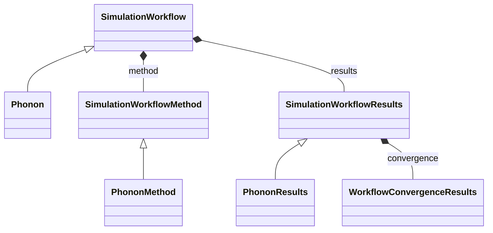

# Phonon Workflow

**Purpose:** Phonon workflow specialization with method/results classes

**In scope:**

- Phonon inheritance from SimulationWorkflow
- Phonon method/result specialization hierarchy
- Workflow structure for finite-displacement/phonon-property computations

## Relationship map

Legend

<svg class="uml-legend__swatch" viewBox="0 0 64 16" aria-hidden="true"><line class="uml-legend__line" x1="54" y1="8" x2="22" y2="8"/><path class="uml-legend__head uml-legend__head--open" d="M10 8 L22 2 L22 14 Z"/></svg>inheritance (is-a)

<svg class="uml-legend__swatch" viewBox="0 0 64 16" aria-hidden="true"><path class="uml-legend__head uml-legend__head--filled" d="M10 8 L16 2 L22 8 L16 14 Z"/><line class="uml-legend__line" x1="22" y1="8" x2="52" y2="8"/></svg>composition (has-a)

## Quantities by Key Sections

### `SimulationWorkflow`

| Section | Description | MetaInfo |
|---|---|---|
| `SimulationWorkflow` | Base class for simulation workflows. | [Open in MetaInfo browser](https://nomad-lab.eu/prod/v1/develop/gui/analyze/metainfo/nomad_simulations/section_definitions@nomad_simulations.schema_packages.workflow.general.SimulationWorkflow){:target="_blank"} |

*This section has no direct quantities.*

### `SimulationWorkflowMethod`

| Section | Description | MetaInfo |
|---|---|---|
| `SimulationWorkflowMethod` |  | [Open in MetaInfo browser](https://nomad-lab.eu/prod/v1/develop/gui/analyze/metainfo/nomad_simulations/section_definitions@nomad_simulations.schema_packages.workflow.general.SimulationWorkflowMethod){:target="_blank"} |

*This section has no direct quantities.*

### `SimulationWorkflowResults`

| Section | Description | MetaInfo |
|---|---|---|
| `SimulationWorkflowResults` | Base class for simulation workflow results sub-section definition. | [Open in MetaInfo browser](https://nomad-lab.eu/prod/v1/develop/gui/analyze/metainfo/nomad_simulations/section_definitions@nomad_simulations.schema_packages.workflow.general.SimulationWorkflowResults){:target="_blank"} |

| Quantity | Type | Description |
|---|---|---|
| `finished_normally` | m_bool(bool) | Indicates if calculation terminated normally. |
| `is_converged` | m_bool(bool) | Represents if the convergence targets have been reached (True) or not (False). |

### `Phonon`

| Section | Description | MetaInfo |
|---|---|---|
| `Phonon` | Definitions for a phonon workflow. | [Open in MetaInfo browser](https://nomad-lab.eu/prod/v1/develop/gui/analyze/metainfo/nomad_simulations/section_definitions@nomad_simulations.schema_packages.workflow.phonon.Phonon){:target="_blank"} |

*This section has no direct quantities.*

### `PhononMethod`

| Section | Description | MetaInfo |
|---|---|---|
| `PhononMethod` |  | [Open in MetaInfo browser](https://nomad-lab.eu/prod/v1/develop/gui/analyze/metainfo/nomad_simulations/section_definitions@nomad_simulations.schema_packages.workflow.phonon.PhononMethod){:target="_blank"} |

| Quantity | Type | Description |
|---|---|---|
| `force_calculator` | m_str(str) | Name of the program used to calculate the forces. |
| `phonon_calculator` | m_str(str) | Name of the program used to perform phonon calculation. |
| `mesh_density` | m_float64(float) | Density of the k-mesh for sampling. |
| `random_displacements` | m_bool(bool) | Identifies if displacements are made randomly. |
| `with_non_analytic_correction` | m_bool(bool) | Identifies if non-analytical term corrections are applied to dynamical matrix. |
| `with_grueneisen_parameters` | m_bool(bool) | Identifies if Grueneisen parameters are calculated. |

### `PhononResults`

| Section | Description | MetaInfo |
|---|---|---|
| `PhononResults` |  | [Open in MetaInfo browser](https://nomad-lab.eu/prod/v1/develop/gui/analyze/metainfo/nomad_simulations/section_definitions@nomad_simulations.schema_packages.workflow.phonon.PhononResults){:target="_blank"} |

| Quantity | Type | Description |
|---|---|---|
| `n_imaginary_frequencies` | m_int32(int) | Number of modes with imaginary frequencies. |
| `n_bands` | m_int32(int) | Number of phonon bands. |
| `n_qpoints` | m_int32(int) | Number of q points for which phonon properties are evaluated. |
| `qpoints` | m_float64(float) (shape: ['n_qpoints', 3]) | Value of the qpoints. |
| `group_velocity` | m_float64(float) (shape: ['n_qpoints', 'n_bands', 3]) | Calculated value of the group velocity at each qpoint. |
| `n_displacements` | m_int32(int) | Number of independent displacements. |
| `n_atoms` | m_int32(int) | Number of atoms in the simulation cell. |
| `displacements` | m_float64(float) (shape: ['n_displacements', 'n_atoms', 3]) | Value of the displacements applied to each atom in the simulation cell. |

## Related Pages

- [Workflow Overview](../explanation/workflow/overview.md)
