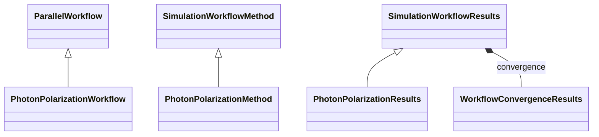

# Photon Polarization Workflow

**Purpose:** Parallel photon-polarization workflow and polarization-resolved results

**In scope:**

- PhotonPolarizationWorkflow inheritance from ParallelWorkflow
- Method and result classes for polarization-dependent spectra
- Parallel execution structure for multiple polarization channels

## Relationship map

Legend

<svg class="uml-legend__swatch" viewBox="0 0 64 16" aria-hidden="true"><line class="uml-legend__line" x1="54" y1="8" x2="22" y2="8"/><path class="uml-legend__head uml-legend__head--open" d="M10 8 L22 2 L22 14 Z"/></svg>inheritance (is-a)

<svg class="uml-legend__swatch" viewBox="0 0 64 16" aria-hidden="true"><path class="uml-legend__head uml-legend__head--filled" d="M10 8 L16 2 L22 8 L16 14 Z"/><line class="uml-legend__line" x1="22" y1="8" x2="52" y2="8"/></svg>composition (has-a)

## Quantities by Key Sections

### `ParallelWorkflow`

| Section | Description | MetaInfo |
|---|---|---|
| `ParallelWorkflow` | Base class for workflows where tasks are executed concurrently. | [Open in MetaInfo browser](https://nomad-lab.eu/prod/v1/develop/gui/analyze/metainfo/nomad_simulations/section_definitions@nomad_simulations.schema_packages.workflow.general.ParallelWorkflow){:target="_blank"} |

*This section has no direct quantities.*

### `SimulationWorkflowMethod`

| Section | Description | MetaInfo |
|---|---|---|
| `SimulationWorkflowMethod` |  | [Open in MetaInfo browser](https://nomad-lab.eu/prod/v1/develop/gui/analyze/metainfo/nomad_simulations/section_definitions@nomad_simulations.schema_packages.workflow.general.SimulationWorkflowMethod){:target="_blank"} |

*This section has no direct quantities.*

### `SimulationWorkflowResults`

| Section | Description | MetaInfo |
|---|---|---|
| `SimulationWorkflowResults` | Base class for simulation workflow results sub-section definition. | [Open in MetaInfo browser](https://nomad-lab.eu/prod/v1/develop/gui/analyze/metainfo/nomad_simulations/section_definitions@nomad_simulations.schema_packages.workflow.general.SimulationWorkflowResults){:target="_blank"} |

| Quantity | Type | Description |
|---|---|---|
| `finished_normally` | m_bool(bool) | Indicates if calculation terminated normally. |
| `is_converged` | m_bool(bool) | Represents if the convergence targets have been reached (True) or not (False). |

### `PhotonPolarizationWorkflow`

| Section | Description | MetaInfo |
|---|---|---|
| `PhotonPolarizationWorkflow` | Definitions for photon polarization workflow. | [Open in MetaInfo browser](https://nomad-lab.eu/prod/v1/develop/gui/analyze/metainfo/nomad_simulations/section_definitions@nomad_simulations.schema_packages.workflow.photon_polarization.PhotonPolarizationWorkflow){:target="_blank"} |

*This section has no direct quantities.*

### `PhotonPolarizationMethod`

| Section | Description | MetaInfo |
|---|---|---|
| `PhotonPolarizationMethod` | Defines the full macroscopic dielectric tensor methodology: BSE method reference. | [Open in MetaInfo browser](https://nomad-lab.eu/prod/v1/develop/gui/analyze/metainfo/nomad_simulations/section_definitions@nomad_simulations.schema_packages.workflow.photon_polarization.PhotonPolarizationMethod){:target="_blank"} |

| Quantity | Type | Description |
|---|---|---|
| `bse_method_ref` | Reference | BSE methodology reference. |

### `PhotonPolarizationResults`

| Section | Description | MetaInfo |
|---|---|---|
| `PhotonPolarizationResults` | Groups all polarization outputs: spectrum. | [Open in MetaInfo browser](https://nomad-lab.eu/prod/v1/develop/gui/analyze/metainfo/nomad_simulations/section_definitions@nomad_simulations.schema_packages.workflow.photon_polarization.PhotonPolarizationResults){:target="_blank"} |

| Quantity | Type | Description |
|---|---|---|
| `n_polarizations` | m_int32(int32) | Number of polarizations for the phonons used for the calculations. |
| `spectrum_polarization` | Reference (shape: ['n_polarizations']) | Spectrum for a given polarization of the photon. |

## Related Pages

- [Workflow Overview](../explanation/workflow/overview.md)
