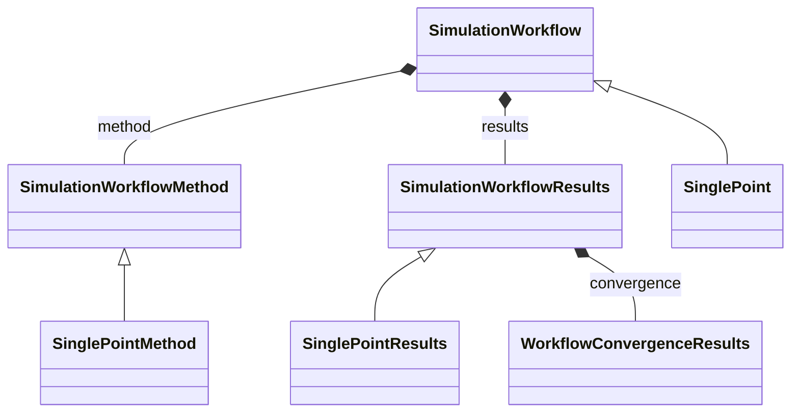

# Single-Point Workflow

**Purpose:** Single-point workflow and its method/results classes

**In scope:**

- SinglePoint inheritance from SimulationWorkflow
- SinglePoint method and results class specializations
- Minimal workflow pattern for one-step calculations

## Relationship map

Legend

<svg class="uml-legend__swatch" viewBox="0 0 64 16" aria-hidden="true"><line class="uml-legend__line" x1="54" y1="8" x2="22" y2="8"/><path class="uml-legend__head uml-legend__head--open" d="M10 8 L22 2 L22 14 Z"/></svg>inheritance (is-a)

<svg class="uml-legend__swatch" viewBox="0 0 64 16" aria-hidden="true"><path class="uml-legend__head uml-legend__head--filled" d="M10 8 L16 2 L22 8 L16 14 Z"/><line class="uml-legend__line" x1="22" y1="8" x2="52" y2="8"/></svg>composition (has-a)

## Key sections

| Section | Description | MetaInfo |
|---|---|---|
| `SimulationWorkflow` | Base class for simulation workflows. | [Open in MetaInfo browser](https://nomad-lab.eu/prod/v1/develop/gui/analyze/metainfo/nomad_simulations/section_definitions@nomad_simulations.schema_packages.workflow.general.SimulationWorkflow){:target="_blank"} |
| `SimulationWorkflowMethod` |  | [Open in MetaInfo browser](https://nomad-lab.eu/prod/v1/develop/gui/analyze/metainfo/nomad_simulations/section_definitions@nomad_simulations.schema_packages.workflow.general.SimulationWorkflowMethod){:target="_blank"} |
| `SimulationWorkflowResults` | Base class for simulation workflow results sub-section definition. | [Open in MetaInfo browser](https://nomad-lab.eu/prod/v1/develop/gui/analyze/metainfo/nomad_simulations/section_definitions@nomad_simulations.schema_packages.workflow.general.SimulationWorkflowResults){:target="_blank"} |
| `SinglePoint` | Definitions for single point workflow. | [Open in MetaInfo browser](https://nomad-lab.eu/prod/v1/develop/gui/analyze/metainfo/nomad_simulations/section_definitions@nomad_simulations.schema_packages.workflow.single_point.SinglePoint){:target="_blank"} |
| `SinglePointMethod` | Contains definitions for the input model of a single point workflow. | [Open in MetaInfo browser](https://nomad-lab.eu/prod/v1/develop/gui/analyze/metainfo/nomad_simulations/section_definitions@nomad_simulations.schema_packages.workflow.single_point.SinglePointMethod){:target="_blank"} |
| `SinglePointResults` | Contains defintions for the results of a single point workflow. | [Open in MetaInfo browser](https://nomad-lab.eu/prod/v1/develop/gui/analyze/metainfo/nomad_simulations/section_definitions@nomad_simulations.schema_packages.workflow.single_point.SinglePointResults){:target="_blank"} |

## Quantities by section

### `SimulationWorkflow`

*This section has no direct quantities.*

### `SimulationWorkflowMethod`

*This section has no direct quantities.*

### `SimulationWorkflowResults`

| Quantity | Type | Description |
|---|---|---|
| `finished_normally` | m_bool(bool) | Indicates if calculation terminated normally. |
| `is_converged` | m_bool(bool) | Represents if the convergence targets have been reached (True) or not (False). |

### `SinglePoint`

*This section has no direct quantities.*

### `SinglePointMethod`

*This section has no direct quantities.*

### `SinglePointResults`

*This section has no direct quantities.*

## Related Pages

- [Workflow Overview](../explanation/workflow/overview.md)
