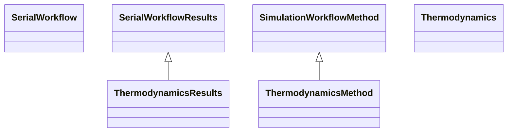

# Thermodynamics Workflow

**Purpose:** Thermodynamics workflow specialization and serial-result integration

**In scope:**

- Thermodynamics inheritance from SimulationWorkflow
- Thermodynamics method specialization structure
- ThermodynamicsResults inheritance from SerialWorkflowResults

## Relationship map

Legend

<svg class="uml-legend__swatch" viewBox="0 0 64 16" aria-hidden="true"><line class="uml-legend__line" x1="54" y1="8" x2="22" y2="8"/><path class="uml-legend__head uml-legend__head--open" d="M10 8 L22 2 L22 14 Z"/></svg>inheritance (is-a)

## Key sections

| Section | Description | MetaInfo |
|---|---|---|
| `SerialWorkflow` | Base class for workflows where tasks are executed sequentially. | [Open in MetaInfo browser](https://nomad-lab.eu/prod/v1/develop/gui/analyze/metainfo/nomad_simulations/section_definitions@nomad_simulations.schema_packages.workflow.general.SerialWorkflow){:target="_blank"} |
| `SerialWorkflowResults` |  | [Open in MetaInfo browser](https://nomad-lab.eu/prod/v1/develop/gui/analyze/metainfo/nomad_simulations/section_definitions@nomad_simulations.schema_packages.workflow.general.SerialWorkflowResults){:target="_blank"} |
| `SimulationWorkflowMethod` |  | [Open in MetaInfo browser](https://nomad-lab.eu/prod/v1/develop/gui/analyze/metainfo/nomad_simulations/section_definitions@nomad_simulations.schema_packages.workflow.general.SimulationWorkflowMethod){:target="_blank"} |
| `Thermodynamics` |  | [Open in MetaInfo browser](https://nomad-lab.eu/prod/v1/develop/gui/analyze/metainfo/nomad_simulations/section_definitions@nomad_simulations.schema_packages.workflow.thermodynamics.Thermodynamics){:target="_blank"} |
| `ThermodynamicsMethod` |  | [Open in MetaInfo browser](https://nomad-lab.eu/prod/v1/develop/gui/analyze/metainfo/nomad_simulations/section_definitions@nomad_simulations.schema_packages.workflow.thermodynamics.ThermodynamicsMethod){:target="_blank"} |
| `ThermodynamicsResults` |  | [Open in MetaInfo browser](https://nomad-lab.eu/prod/v1/develop/gui/analyze/metainfo/nomad_simulations/section_definitions@nomad_simulations.schema_packages.workflow.thermodynamics.ThermodynamicsResults){:target="_blank"} |

## Quantities by section

### `SerialWorkflow`

*This section has no direct quantities.*

### `SerialWorkflowResults`

*This section has no direct quantities.*

### `SimulationWorkflowMethod`

*This section has no direct quantities.*

### `Thermodynamics`

*This section has no direct quantities.*

### `ThermodynamicsMethod`

*This section has no direct quantities.*

### `ThermodynamicsResults`

*This section has no direct quantities.*

