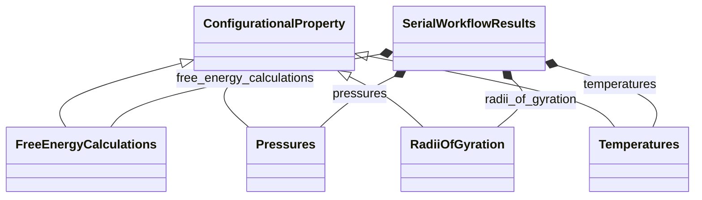

# Workflow Trajectory Properties

**Purpose:** Serial-workflow trajectory/configurational property subsections

## Relationship map

Legend

<svg class="uml-legend__swatch" viewBox="0 0 64 16" aria-hidden="true"><line class="uml-legend__line" x1="54" y1="8" x2="22" y2="8"/><path class="uml-legend__head uml-legend__head--open" d="M10 8 L22 2 L22 14 Z"/></svg>inheritance (is-a)

<svg class="uml-legend__swatch" viewBox="0 0 64 16" aria-hidden="true"><path class="uml-legend__head uml-legend__head--filled" d="M10 8 L16 2 L22 8 L16 14 Z"/><line class="uml-legend__line" x1="22" y1="8" x2="52" y2="8"/></svg>composition (has-a)

## Quantities by Key Sections

### `SerialWorkflowResults`

| Section | Description | MetaInfo |
|---|---|---|
| `SerialWorkflowResults` |  | [Open in MetaInfo browser](https://nomad-lab.eu/prod/v1/develop/gui/analyze/metainfo/nomad_simulations/section_definitions@nomad_simulations.schema_packages.workflow.general.SerialWorkflowResults){:target="_blank"} |

*This section has no direct quantities.*

### `ConfigurationalProperty`

| Section | Description | MetaInfo |
|---|---|---|
| `ConfigurationalProperty` | Abstract base section for observables calculated and stored at each individual frame of a trajectory. | [Open in MetaInfo browser](https://nomad-lab.eu/prod/v1/develop/gui/analyze/metainfo/nomad_simulations/section_definitions@nomad_simulations.schema_packages.workflow.trajectory.ConfigurationalProperty){:target="_blank"} |

| Quantity | Type | Description |
|---|---|---|
| `n_frames` | m_int32(int) | Number of frames for which the observable is stored. |
| `frames` | m_int32(int32) (shape: ['n_frames']) | Frames for which the observable is stored. |
| `times` | m_float64(float64) (shape: ['n_frames']) | Times for which the observable is stored. |

### `Temperatures`

| Section | Description | MetaInfo |
|---|---|---|
| `Temperatures` | Temperature as a function of time. | [Open in MetaInfo browser](https://nomad-lab.eu/prod/v1/develop/gui/analyze/metainfo/nomad_simulations/section_definitions@nomad_simulations.schema_packages.workflow.trajectory.Temperatures){:target="_blank"} |

| Quantity | Type | Description |
|---|---|---|
| `value` | m_float64(float64) (shape: ['*']) | Specifies the temperature over a series of frames/steps. |

### `Pressures`

| Section | Description | MetaInfo |
|---|---|---|
| `Pressures` | Pressure as a function of time. | [Open in MetaInfo browser](https://nomad-lab.eu/prod/v1/develop/gui/analyze/metainfo/nomad_simulations/section_definitions@nomad_simulations.schema_packages.workflow.trajectory.Pressures){:target="_blank"} |

| Quantity | Type | Description |
|---|---|---|
| `value` | m_float64(float64) (shape: ['*']) | Specifies the pressure over a series of frames/steps. |

### `RadiiOfGyration`

| Section | Description | MetaInfo |
|---|---|---|
| `RadiiOfGyration` | Section containing information about the calculation of radius of gyration (Rg). | [Open in MetaInfo browser](https://nomad-lab.eu/prod/v1/develop/gui/analyze/metainfo/nomad_simulations/section_definitions@nomad_simulations.schema_packages.workflow.trajectory.RadiiOfGyration){:target="_blank"} |

| Quantity | Type | Description |
|---|---|---|
| `value` | m_float64(float64) (shape: ['n_frames']) | Values of the property. |

### `FreeEnergyCalculations`

| Section | Description | MetaInfo |
|---|---|---|
| `FreeEnergyCalculations` | Section containing information regarding the instantaneous (i.e., for a single configuration) values of free energies calculated via thermodynamic perturbation. | [Open in MetaInfo browser](https://nomad-lab.eu/prod/v1/develop/gui/analyze/metainfo/nomad_simulations/section_definitions@nomad_simulations.schema_packages.workflow.trajectory.FreeEnergyCalculations){:target="_blank"} |

| Quantity | Type | Description |
|---|---|---|
| `method_ref` | Reference | Links the free energy results with the method parameters. |
| `lambda_index` | m_int32(int) | Index of the lambda state for the present simulation within the free energy calculation workflow. I.e., lambda = method_ref.lambdas.values[lambda_index] |
| `n_states` | m_int32(int) | Number of states defined for the interpolation of the system, as indicate in `method_ref`. |
| `value_total_energy_magnitude` | HDF5Dataset | Value of the total energy for the present lambda state. The expected dimensions are ["n_frames"]. This quantity is a reference to the data (file+path), which is stored in an HDF5 file for efficiency. |
| `value_PV_energy_magnitude` | HDF5Dataset | Value of the pressure-volume energy (i.e., P*V) for the present lambda state. The expected dimensions are ["n_frames"]. This quantity is a reference to the data (file+path), which is stored in an HDF5 file for efficiency. |
| `value_total_energy_differences_magnitude` | HDF5Dataset | 

Values correspond to the difference in total energy between each specified lambd...
Values correspond to the difference in total energy between each specified lambda state and the reference state, which corresponds to the value of lambda of the current simulation. The expected dimensions are ["n_frames", "n_states"]. This quantity is a reference to the data (file+path), which is stored in an HDF5 file for efficiency.
 |
| `value_total_energy_derivative_magnitude` | HDF5Dataset | Value of the derivative of the total energy with respect to lambda, evaluated for the current lambda state. The expected dimensions are ["n_frames"]. This quantity is a reference to the data (file+path), which is stored in an HDF5 file for efficiency. |

## Related Pages

- [Workflow Overview](../explanation/workflow/overview.md)
