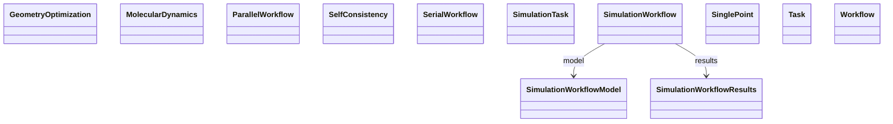

# Workflows

**Purpose.** End-to-end procedures composed of tasks (e.g., SCF, MD, geometry optimization).
**In scope:** task graphs, iteration loops, task references
**Out of scope:** final results (handled in Results)

## Relationship map





## Key sections

| Section | Description | MetaInfo |
|---|---|---|
| `Workflow` | Instances of Workflow are used to represent a set of Tasks that connect input and output data objects to produce a provenance graph for those data. | [Open in MetaInfo browser](https://nomad-lab.eu/prod/v1/oasis/gui/analyze/metainfo) |
| `SimulationWorkflow` | Base class for simulation workflows. | [Open in MetaInfo browser](https://nomad-lab.eu/prod/v1/oasis/gui/analyze/metainfo) |
| `ParallelWorkflow` | Base class for workflows where tasks are executed concurrently. | [Open in MetaInfo browser](https://nomad-lab.eu/prod/v1/oasis/gui/analyze/metainfo) |
| `SerialWorkflow` | Base class for workflows where tasks are executed sequentially. | [Open in MetaInfo browser](https://nomad-lab.eu/prod/v1/oasis/gui/analyze/metainfo) |
| `GeometryOptimization` | Definitions for geometry optimization workflow. | [Open in MetaInfo browser](https://nomad-lab.eu/prod/v1/oasis/gui/analyze/metainfo) |
| `MolecularDynamics` |  | [Open in MetaInfo browser](https://nomad-lab.eu/prod/v1/oasis/gui/analyze/metainfo) |
| `SinglePoint` | Definitions for single point workflow. | [Open in MetaInfo browser](https://nomad-lab.eu/prod/v1/oasis/gui/analyze/metainfo) |
| `Task` | Instances of Task are used to represent an activity that happened during workflow execution and that was acting on inputs to produce outputs. | [Open in MetaInfo browser](https://nomad-lab.eu/prod/v1/oasis/gui/analyze/metainfo) |
| `SimulationTask` |  | [Open in MetaInfo browser](https://nomad-lab.eu/prod/v1/oasis/gui/analyze/metainfo) |
| `SelfConsistency` | A base section used to define the convergence settings of self-consistent field (SCF) calculation. | [Open in MetaInfo browser](https://nomad-lab.eu/prod/v1/oasis/gui/analyze/metainfo) |


## Micro-examples

=== "YAML"

    ```yaml
    Workflow:
      tasks:
      - {}
    SimulationWorkflow:
      model: {}
      results: {}
    ParallelWorkflow: {}
    SerialWorkflow: {}
    GeometryOptimization: {}
    MolecularDynamics: {}
    SinglePoint: {}
    Task:
      name:
      - null
      section:
      - null
      inputs:
      - {}
      outputs:
      - {}
    SimulationTask: {}
    SelfConsistency:
      scf_minimization_algorithm:
      - null
      n_max_iterations:
      - null
      threshold_change:
      - null
      threshold_change_unit:
      - null
    ```